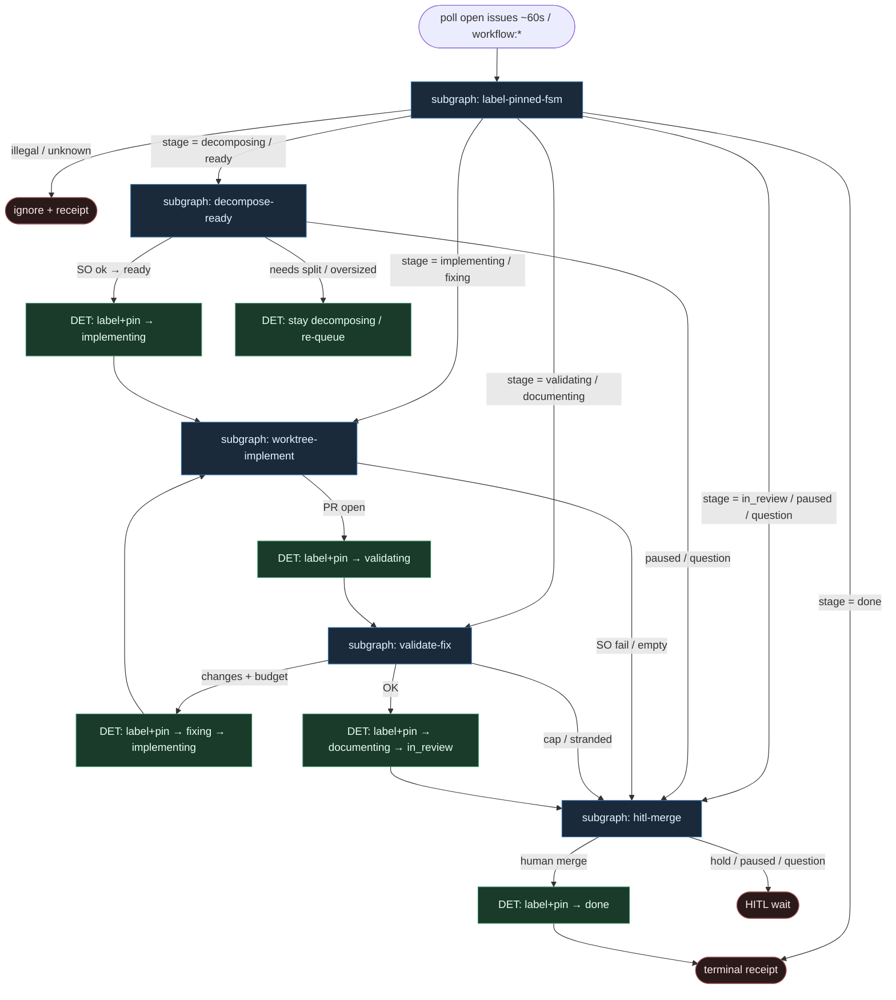

# 41 — Chippingway FSM (label + pinned JSON)

**Persona:** chippingway-fsm compose — etapy = `workflow:*` **oraz** przypięty komentarz JSON na issue; **lokalny orchestrator** przesuwa stany; **agenci tylko wypełniają sloty** w izolowanym git worktree (Claude decompose/dev, Codex review).

**Approach:** `compose_chippingway_fsm`. Źródło prawdy FSM = etykieta stage + pinned JSON (mirror). Executor = lokalny daemon (`./run.sh`, poll ~60s) — nie GHA jako primary advance. HITL na merge; orchestrator **nie** merge'uje.

## Design notes

- **Dual state store.** `workflow:decomposing|ready|implementing|validating|fixing|documenting|in_review|paused|question|done` + pinned JSON comment (`stage`, `worktree`, `pr_url`, `conflict_rounds`, …). Label = szybki mutex; JSON = audytowalny snapshot.
- **Orchestrator advances.** Tylko daemon/skrypt flipuje etykiety i aktualizuje pin. Agent **nie** woła `gh label` ani nie edytuje pinu „bo tak wyszło z promptu”.
- **Poll intake.** Otwarte issues bez osobnego „ready” — decomposer / `DECOMPOSE=off` bierze kolejkę. Człowiek może `paused` / `question`.
- **Worktree sandbox.** Izolacja = git worktree na hoście; CLI z danger/bypass — granica = host.
- **Role remap.** `DECOMPOSE_AGENT` / `DEV_AGENT` / `REVIEW_AGENT` — domyślnie Claude (decompose+implement), Codex (review).
- **Bounded conflict.** `MAX_CONFLICT_ROUNDS`, `MAX_ADDED_LINES`; oversized → z powrotem do `workflow:decomposing`.
- **Coder ≠ merge.** Sufit DevAgent = push + open PR + etykieta `workflow:validating` → documenting → `in_review` + jeden ping HITL.
- **DET majority.** Poll / claim / flip label / pin JSON / worktree / test gate / push / open PR / HITL ping — DET. Entropia tylko w slotach AGENT.
- **Meat ≡ AI.** To samo siedzenie w slocie; graf się nie zmienia.
- **NOT L5.** Zdejmujemy klepanie issue→PR→review ping. Nie lights-out bank.

## Top-level flowchart

**DET vs AGENT at a glance**

| Warstwa | Mode | Kto | Uwaga |
|---------|------|-----|-------|
| Poll open issues | DET | orchestrator | ~60s; bez chat-pick |
| Flip `workflow:*` + pin JSON | DET | orchestrator | agent nie flipuje |
| Decompose SO | AGENT slot | DecomposeAgent | po ok → DET ready/implementing |
| Implement w worktree | AGENT slot | DevAgent | Claude/remap |
| Push / open PR | DET | orchestrator | sufit kodera |
| Review pass | AGENT slot | ReviewAgent | Codex/remap |
| Documenting → in_review | DET | orchestrator | jeden HITL ping |
| Merge | HITL | człowiek | orchestrator nie merge'uje |
| paused / question | DET escape | człowiek lub orch. | obowiązkowy exit |

## Index of subgraphs

| File | Theme | Role in chain |
|------|--------|----------------|
| [subgraph-label-pinned-fsm.md](./subgraph-label-pinned-fsm.md) | label mutex + pinned JSON mirror | DET kręgosłup FSM |
| [subgraph-decompose-ready.md](./subgraph-decompose-ready.md) | decompose → ready | AGENT decompose; DET advance |
| [subgraph-worktree-implement.md](./subgraph-worktree-implement.md) | worktree + DevAgent → PR | AGENT kod; DET git |
| [subgraph-validate-fix.md](./subgraph-validate-fix.md) | review + fixing + documenting | AGENT review; DET cap |
| [subgraph-hitl-merge.md](./subgraph-hitl-merge.md) | in_review ping + paused/question | HITL merge only |

## Label vocabulary (chippingway)

| Label | Znaczenie | Kto może ustawić |
|-------|-----------|------------------|
| `workflow:decomposing` | rozbicie / oversized re-entry | orchestrator, człowiek |
| `workflow:ready` | gotowe do implementacji | orchestrator |
| `workflow:implementing` | DevAgent w worktree | orchestrator |
| `workflow:validating` | ReviewAgent pass | orchestrator po PR |
| `workflow:fixing` | bounded conflict repair | orchestrator |
| `workflow:documenting` | docs / PR body polish | orchestrator |
| `workflow:in_review` | czeka na człowieka | orchestrator |
| `workflow:paused` | człowiek zatrzymał | człowiek / orch. |
| `workflow:question` | pytanie do człowieka | orch. / agent→DET |
| `workflow:done` | terminal po merge | orchestrator |

Pinned JSON (skrót): `{ "stage", "issue_id", "worktree", "branch", "pr_url", "conflict_rounds", "added_lines", "agents", "updated_at" }` — zawsze zsynchronizowany z aktywną etykietą stage.

## Antyteza (czego tu nie ma)

- Agent wybierający next issue z czatu / unlabeled backlogu
- Agent sam flipujący `workflow:*` albo edytujący pin JSON
- GHA jako jedyne źródło prawdy (tu primary = lokalny daemon)
- Fat orchestrator tool-callingiem zamiast tabeli przejść
- Unbounded fixing bez `MAX_CONFLICT_ROUNDS` / escape
- Merge w liściu DevAgent / ReviewAgent
- L5 lights-out / wymyślanie ticketów
