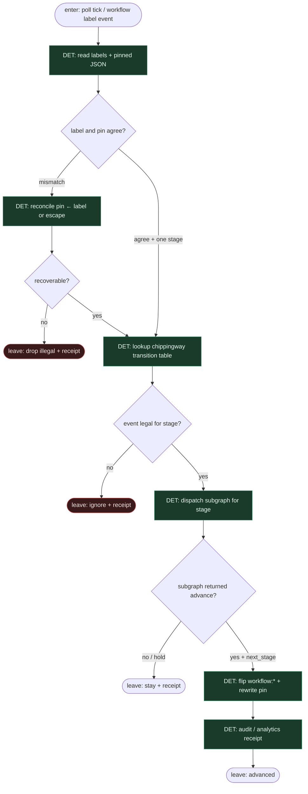

# Subgraph: label-pinned-fsm

**Theme:** `workflow:*` = stan + **pinned JSON** = mirror; tylko lokalny orchestrator flipuje; mutex jednej stage-label.  
**Mode mix:** 100% DET. Zero AGENT w kręgosłupie.

## Flow

## Transition table (compose)

| From | Event / predicate | To | Who flips |
|------|-------------------|----|-----------|
| open issue / none | poll claim | `decomposing` | orchestrator |
| `decomposing` | decompose SO ok | `ready` | orchestrator |
| `ready` | job start | `implementing` | orchestrator |
| `implementing` | PR open | `validating` | orchestrator |
| `validating` | review changes + budget | `fixing` | orchestrator |
| `fixing` | re-enter implement | `implementing` | orchestrator |
| `validating` | review OK | `documenting` | orchestrator |
| `documenting` | docs done | `in_review` | orchestrator |
| `in_review` | human merge | `done` | orchestrator |
| `*` | human pause | `paused` | człowiek / orch. |
| `*` | needs answer | `question` | orch. |
| `*` | oversized lines | `decomposing` | orchestrator |
| `*` | conflict cap | `paused` / `question` | orchestrator |

## Notes

- **chippingway DNA.** Label + pinned JSON na issue — nie pamięć agenta, nie czat.
- **Orchestrator owns advance.** Agent nigdy nie routuje; SO zwraca enum, skrypt mapuje na tabelę.
- **Handoff:** `{stage, issue_id, pin, next?}` albo `{drop|ignore}`.
