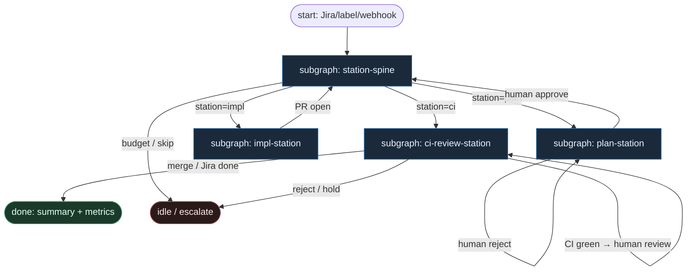

# 42 — Forge Stations (forge-sdlc / LangGraph)

**Persona:** forge-stations compose — **LangGraph typed stations** (`plan` / `impl` / `ci` / `review`); agent wypełnia bieżącą stację, **nigdy nie routuje** między etapami.

**Approach:** compose. Mapowanie [forge-sdlc/forge](https://github.com/forge-sdlc/forge) (instance `forge-sdlc-forge`, SPINE_INDEX `spine_deterministic`, conf 82) na duszę klepacza: ticket→PR, workflow-first, nie „jeden duży prompt”.

## Design notes

- **Stacje są typowane w grafie.** `TypedStation = plan | impl | ci | review`. Krawędzie LangGraph StateGraph są **DET** — enum stacji + bramki (HITL plan, CI green/red, human PR review). Model nie wybiera „co dalej”.
- **Agent = seat w stacji.** SO / Deep-Agent leaf działa *wewnątrz* węzła stacji (plan artifacts, implement diff, CI repair patch, review critique). Po `ok` wraca do DET advance — nie woła „goto impl”.
- **HITL na planie.** Plan (PRD/epic/tasks, cross-repo OK) wymaga human approve zanim spine przejdzie do `impl`. Odrzucenie = powrót do stacji plan, nie ReAct limbo.
- **Impl w Podman.** Efemeryczny kontener per repo, scoped access; commit → push → fork-based PR. Sufit kodera = open PR.
- **CI repair bounded.** Czerwone CI → stacja `ci` (bounded N), nie nieskończona pętla narzędzia. Zielone → stacja `review`.
- **Human PR review przed merge.** Zawsze. MergePolicy Off|Classify|Always; produkcja za bramką człowieka. NOT L5.
- **Checkpoint + journal.** LangGraph checkpoints + dziennik efektów zewnętrznych (Jira/GitHub/Podman) — replay-safe spine, nie pamięć w prompcie.
- **Meat ≡ AI w slocie.** To samo siedzenie SO w stacji; spine nie rozróżnia.

## Top-level flowchart

**DET vs AGENT at a glance**

| Layer / seat | Mode | Responsibility |
|--------------|------|----------------|
| LangGraph StateGraph body | DET | Typed station edges, checkpoints, budgets |
| Webhook / label intake | DET | Jira/GitHub trigger → claim K=1 |
| **plan** station slot | AGENT SO | PRD/epic/tasks artifacts |
| Human approve plan | HITL | Gate przed `impl` |
| **impl** station slot | AGENT SO | Implement w Podman; structured diffs |
| commit / push / open PR | DET | Sufit kodera |
| **ci** station + repair slot | DET poll + AGENT SO | Bounded repair on red CI |
| **review** station | HITL (+ optional SO critique) | Human PR review; nigdy self-stamp merge |
| Merge policy Off\|Classify\|Always | DET / HITL | Manifest + human na prod |
| Agent choosing next station | — | **FORBIDDEN** |

## Index of subgraphs

| File | Theme | Role in chain |
|------|--------|----------------|
| [subgraph-station-spine.md](./subgraph-station-spine.md) | LangGraph typed station machine | DET spine: enum → edge → checkpoint |
| [subgraph-plan-station.md](./subgraph-plan-station.md) | plan artifacts + HITL approve | Stacja `plan`; cross-repo OK |
| [subgraph-impl-station.md](./subgraph-impl-station.md) | Podman impl → PR | Stacja `impl`; coder ceiling = open PR |
| [subgraph-ci-review-station.md](./subgraph-ci-review-station.md) | CI repair → human review → Jira | Stacje `ci` + `review` |

## Compose map (forge-sdlc → klepacz)

| Forge SDLC | Klepacz seat |
|------------|--------------|
| Jira ticket / label / comment | DET webhook intake + `ready-for-agent` |
| LangGraph typed stations | fixed enum `plan→impl→ci→review` |
| Plan artifacts PRD/epic/tasks | AGENT SO w stacji `plan` |
| Human approve plan | HITL gate (hexagon) |
| Implement w Podman per repo | AGENT SO + DET sandbox w stacji `impl` |
| GitHub PR fork-based | DET commit → push → open PR |
| CI + auto-repair loop | DET poll + bounded AGENT repair w `ci` |
| Human PR review | HITL (+ optional critique SO); merge button ≠ agent |
| Jira summary + metrics | DET finalize / notifier |
| Agent as station router | **FORBIDDEN** |

## Antyteza (czego tu nie ma)

- ReAct / fat orchestrator wybierający następną stację
- Jeden monolityczny prompt „zrób ticket end-to-end”
- Agent flipujący etykiety / board columns jako control plane
- Nieskończona CI repair bez budgetu
- Self-merge przez tego samego liścia co implement
- L5 lights-out / „wyrzuć człowieka”

## Kryterium sukcesu

Człowiek ma energię na architekturę i niewygodne pytania — bo typed stations + Podman + CI nie spalają dnia na klepanie git/Jira. Technicznie: LangGraph doprowadza do otwartego (i po human review opcjonalnie zmergowanego) `ai/*` PR; agent **nigdy** nie wybiera następnej stacji.
