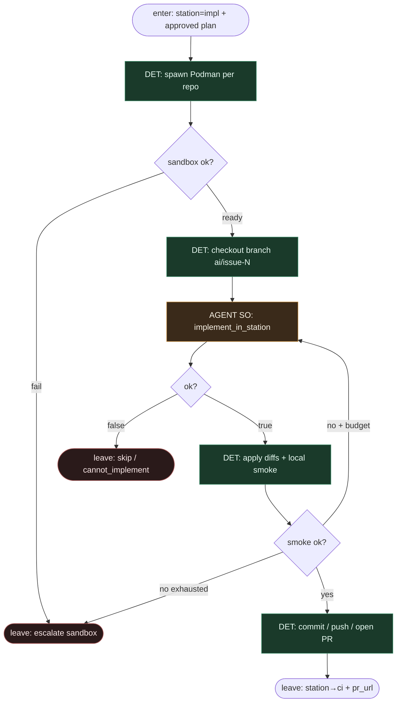

# Subgraph: impl-station

**Theme:** stacja `impl` — implementacja w efemerycznym Podman + open PR.  
**Mode mix:** DET sandbox lifecycle + AGENT SO `implement_in_station`. Sufit = open PR; zero merge.

## Flow



## Notes

- **Podman ephemeral.** Scoped repo mount, non-root, sieć wg polityki forge. Po stacji kontener pada; stan żyje w gicie + journal.
- **Agent bez routingu.** SO dostaje plan tasks + wycinek plików; zwraca structured diffs. Nie woła „open PR” ani „goto ci” — to DET po smoke.
- **Jeden ticket, jeden PR (K=1).** Cross-repo = sekwencja sandboxów w tej samej stacji, jeden logical PR set / linked PRs — nie równoległy chaos occupancy.
- **Coder ceiling.** `open_pr` kończy stację `impl`. Merge = później, human, inna stacja.
- **Handoff.** `{pr_urls[], branch, commits[], smoke_ok:true}` → ci-review-station.

## Structured output — `implement_in_station`

```json
{
  "ok": true,
  "diffs": [
    {"repo": "org/app", "path": "src/api.py", "patch": "--- a/...\\n+++ b/..."}
  ],
  "notes": "implements task-1",
  "tests_touched": ["tests/test_api.py"]
}
```

```json
{ "ok": false, "reason": "cannot_implement|plan_gap|sandbox_limit|dangerous" }
```
