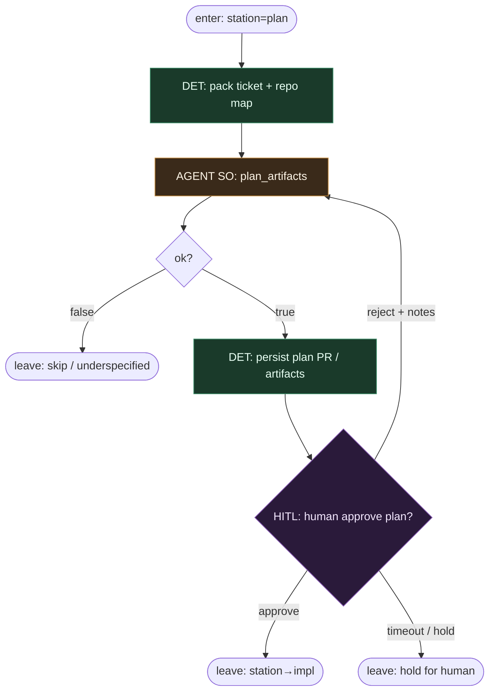

# Subgraph: plan-station

**Theme:** stacja `plan` — artefakty PRD/epic/tasks + human approve.  
**Mode mix:** AGENT SO `plan_artifacts` + HITL gate. Agent nie przechodzi sam do `impl`.

## Flow



## Notes

- **Cross-repo OK.** Forge SDLC planuje po wielu repo; SO zwraca `repos[]` + tasks per repo. Impl potem spawnuje Podman per repo.
- **HITL jest krawędzią.** Approve = DET advance `plan→impl`. Reject wraca do tego samego slotu z notes — nie „agent zdecydował iść dalej”.
- **Artefakty, nie czat.** PRD / epic / task list to wersjonowane pliki (np. plan PR), nie ulotny thread.
- **Fail closed.** `ok:false` (underspecified / too_large / dangerous) → skip/hold; spine nie wchodzi w `impl`.
- **Handoff.** `{plan_id, repos[], tasks[], acceptance[], approved_by}` → impl-station.

## Structured output — `plan_artifacts`

```json
{
  "ok": true,
  "summary": "short epic intent",
  "repos": ["org/app", "org/lib"],
  "tasks": [
    {"repo": "org/app", "title": "add endpoint", "files_hint": ["src/api.py"]}
  ],
  "acceptance": ["CI green", "endpoint returns 200"],
  "risks": ["migration"],
  "confidence": "high"
}
```

```json
{ "ok": false, "reason": "underspecified|too_large|dangerous|cross_repo_unclear" }
```
