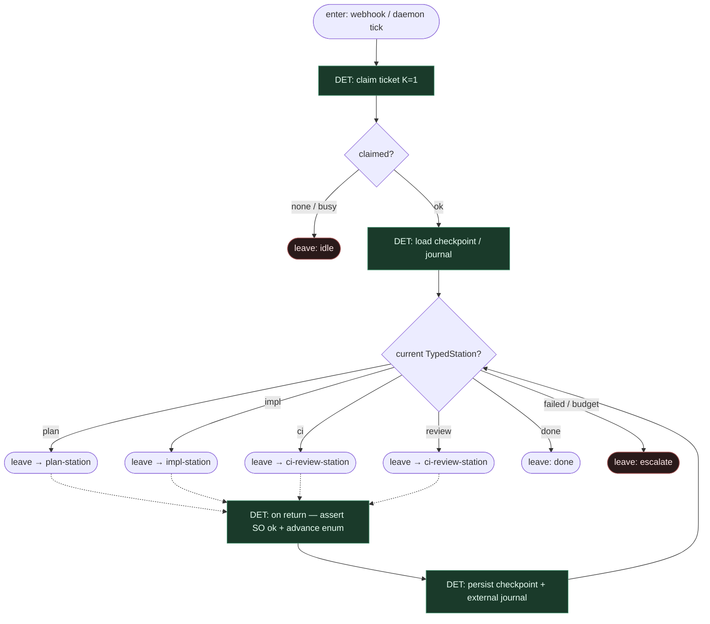

# Subgraph: station-spine

**Theme:** LangGraph StateGraph jako DET maszyna typowanych stacji.  
**Mode mix:** wyłącznie DET — enum stacji, krawędzie, checkpointy, budgety. Zero LLM w ciele spine.

## Flow



## Notes

- **TypedStation enum.** `plan | impl | ci | review | done | failed`. Przejścia tylko przez DET `advance(station, gate_result)` — nie przez tekst z modelu.
- **Agent nie routuje.** Liść SO zwraca structured payload dla *bieżącej* stacji; spine decyduje o krawędzi. Zakaz `next_station` w SO.
- **Checkpoint + journal.** LangGraph checkpointer trzyma stan grafu; osobny journal efektów (Jira comment id, PR number, Podman run id) dla idempotencji / replay.
- **Budżety.** `ci_repair_n`, occupancy K=1, timeout stacji — fail closed → `failed` / escalate, nie limbo.
- **Handoff contract.** `{ticket, station, checkpoint_id, worktree_or_podman_ref, artifacts[]}` albo idle/escalate.

## Station advance (DET)

```json
{
  "from": "plan",
  "gate": "human_approve_plan",
  "result": "approved",
  "to": "impl"
}
```

```json
{
  "from": "ci",
  "gate": "ci_status",
  "result": "red",
  "repair_used": 2,
  "repair_budget": 3,
  "to": "ci"
}
```
