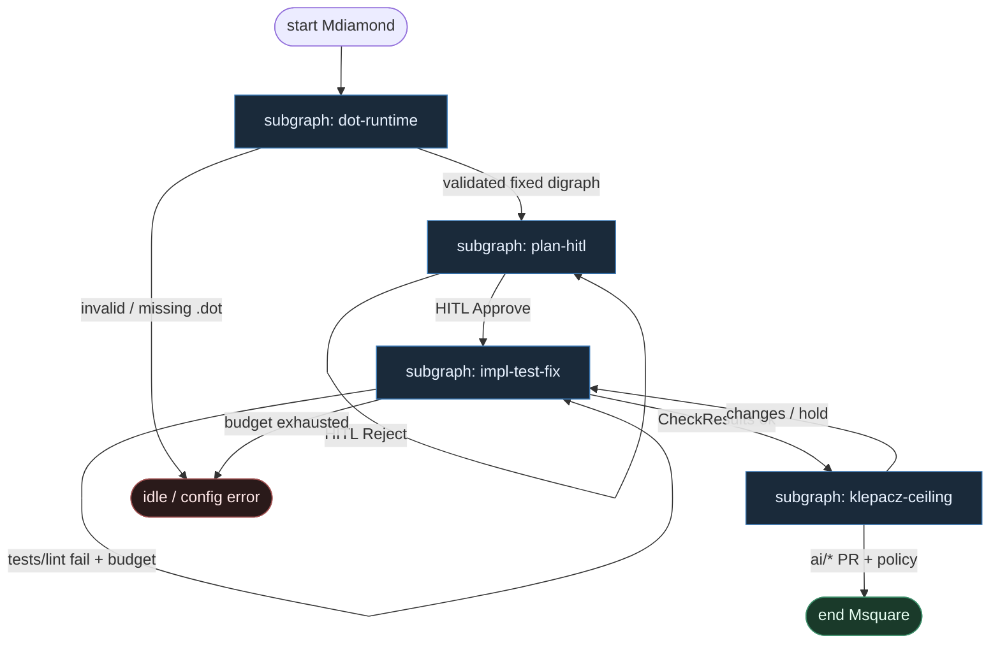
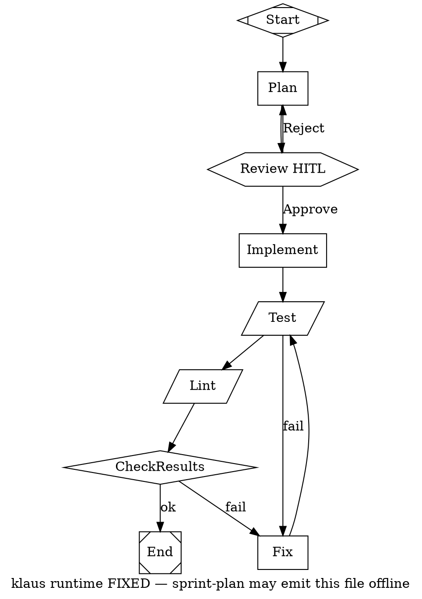

# 43 — Klaus DOT (arikWaisman/klaus compose)

**Persona:** klaus-dot compose — [`klaus run`](https://github.com/arikWaisman/klaus) na `pipelines/*.dot`; **runtime = stały graf**. Skill sprint-plan może *wygenerować* DOT offline, ale runner **nigdy** nie mutuje topologii w locie.

**Approach:** compose. Mapowanie [arikWaisman/klaus](https://github.com/arikWaisman/klaus) (instance `arikwaisman-klaus`, SPINE_INDEX `spine_deterministic`, conf **81**) na duszę klepacza: ticket→PR, Plan→HITL→Implement→Test/Lint→Fix — nie L5, nie gruby mózg-router.

## Design notes

- **`klaus run` = DET walk.** TypeScript factory ładuje `.dot`, waliduje shape allowlist, chodzi po krawędziach. **0 tokenów** orkiestracji. Zmiana procesu = edycja pliku DOT + validate — nie prompt „dziś zrób inaczej”.
- **Runtime fixed graph.** Sprint-plan skill może emitować nowy `plan-and-execute.dot` (lub wariant) *przed* runem; w trakcie `klaus run` graf jest **immutable**. Agent nie dokłada węzłów, nie wybiera „co dalej”.
- **Kanon pipeline (`plan-and-execute.dot`).** Start → Plan (LLM) → Review (HITL hexagon) → Implement (LLM) → Test (shell) → Lint (shell) → CheckResults (diamond) → End; fail → Fix (LLM) → Test. Reject planu wraca do Plan.
- **Shape → rola (Klaus / Attractor-flavored TS).**
  - `box` — LLM leaf: Plan / Implement / Fix
  - `parallelogram` / `tool_command` — DET shell: Test, Lint, git/PR atoms
  - `diamond` — DET CheckResults / budget
  - `hexagon` — HITL Review po Plan
  - `Mdiamond` / `Msquare` — Start / End
- **LLM vs code.** Runner, diamond, shell = **code**. Plan / Implement / Fix = **LLM**. Review = **HITL**, nie LLM-judge merge.
- **Klepacz, nie software-factory theatre.** Bind stage ids do labeled issue → worktree → plan → implement → test → open PR → review → merge policy — nie research→SSG.
- **Meat ≡ AI w boxie.** To samo siedzenie; silnik nie rozróżnia kto wypełnił SO.
- **NOT L5.** Cel: zdjąć wyczerpujące klepanie; człowiek zostaje przy architekturze, Approve planu i (gdy Off) merge.
- **Jeden ticket, jeden PR.** K=1; Fix loop bounded (`fix_loop_n`).
- **Fail closed.** Czerwony test/lint / `ok:false` / brak budżetu → Fix bounded albo exit — nie limbo.
- **Nie alias 14 / 28.** 14 = Attractor PipelineRunner (Python/Go); 28 = Fabro `.fabro` + sandbox engine. Tu: **klaus** TS + `klaus run` + fixed `.dot`.

## Top-level flowchart

**DET vs AGENT at a glance**

| Layer / seat | Mode | Responsibility |
|--------------|------|----------------|
| `klaus run` load + validate `.dot` | DET | Parse digraph; shape allowlist; reject unknown handlers |
| Edge walk / diamond CheckResults | DET | Next node from fixed edges; 0 tokens |
| Test / Lint `tool_command` | DET shell | pytest / eslint / project scripts |
| Plan / Implement / Fix `box` | AGENT SO | LLM fills node only — nie router |
| Review hexagon | HITL | Approve / Reject planu — nie LLM judge |
| pick / worktree / open_pr / merge | DET | Klepacz ceiling (podgraf) |
| Sprint-plan emits DOT | offline / DET skill | Może wygenerować plik; **nie** mutuje runtime |
| LLM picks next node | — | **FORBIDDEN** |

## Index of subgraphs

| File | Theme | Role in chain |
|------|--------|----------------|
| [subgraph-dot-runtime.md](./subgraph-dot-runtime.md) | `klaus run` + fixed `.dot` | DET front: graph-is-code, immutable runtime |
| [subgraph-plan-hitl.md](./subgraph-plan-hitl.md) | Plan LLM + Review hexagon | HITL gate przed implementacją |
| [subgraph-impl-test-fix.md](./subgraph-impl-test-fix.md) | Implement → Test/Lint → Fix → Check | Główna pętla factory |
| [subgraph-klepacz-ceiling.md](./subgraph-klepacz-ceiling.md) | ticket→PR + merge policy | Sufit kodera + exit |

## Compose map (klaus → klepacz)

| Klaus concept | Klepacz seat |
|---------------|--------------|
| `klaus run pipelines/plan-and-execute.dot` | daemon tick / GHA: labeled issue → one run |
| Fixed digraph at runtime | DET FSM ticket→PR (nie department brain) |
| Sprint-plan skill → DOT file | Offline compose / blueprint emit — nie live routing |
| Plan box | AGENT SO `plan_issue` |
| Review hexagon | HITL Approve plan |
| Implement box | AGENT SO implement w worktree |
| Test / Lint shell | DET gate + scripts |
| Fix box | Bounded AGENT repair |
| CheckResults diamond | DET ok/fail → End / Fix |
| Open PR / merge (klepacz bind) | DET atoms + MergePolicy Off\|Classify\|Always |
| LLM as edge chooser | **FORBIDDEN** |
| Fabro / Attractor PipelineRunner | **out of scope** (warianty 28 / 14) |

## Przykładowy szkielet `plan-and-execute.dot` (klepacz-bound)

## Kryterium sukcesu

Człowiek ma energię na architekturę i niewygodne pytania — bo routing i Test/Lint nie spalają tokenów ani dnia. Technicznie: `klaus run` przechodzi **stały** `.dot` do otwartego (i opcjonalnie zmergowanego) `ai/*` na tipie hosta; LLM nigdy nie wybiera następnego węzła; sprint-plan najwyżej emituje plik DOT przed runem.
