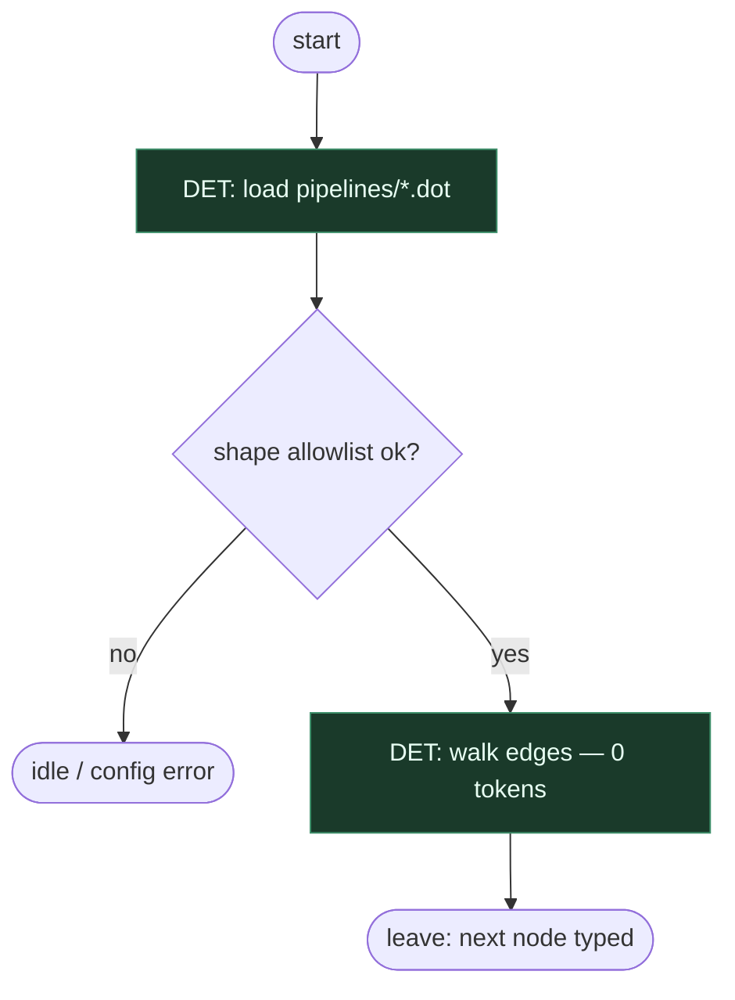

# Subgraph: dot-runtime

**Theme:** `klaus run` ładuje fixed `.dot`; runtime immutable.  
**Mode mix:** 100% DET.

## Flow

## Notes

- Sprint-plan może emitować DOT offline; run nie mutuje grafu.
- LLM nie wybiera next node.
