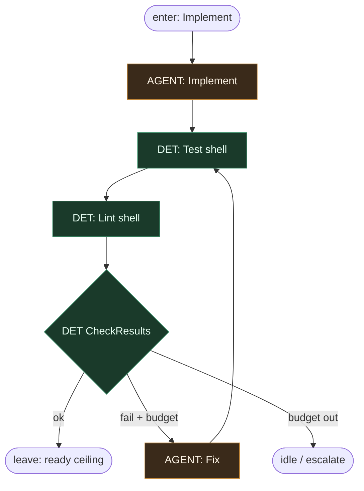

# Subgraph: impl-test-fix

**Theme:** Implement → Test/Lint → CheckResults → Fix bounded.  
**Mode mix:** AGENT boxes + DET shell/diamond.

## Flow

## Notes

- Fix loop bounded (`fix_loop_n`).
- Fail closed — nie limbo.
