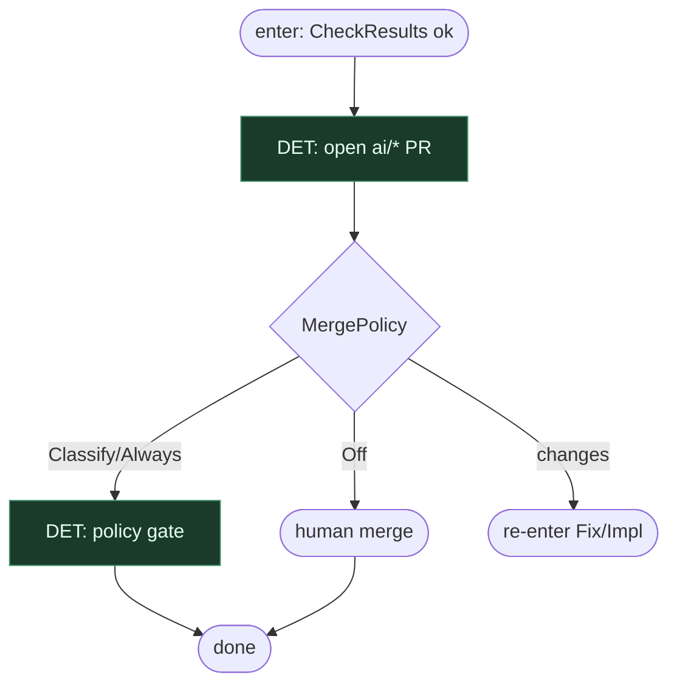

# Subgraph: klepacz-ceiling

**Theme:** ticket→PR atoms + MergePolicy.  
**Mode mix:** DET + HITL merge.

## Flow

```mermaid
flowchart TD
  A([enter: CheckResults ok]) --> PR[DET: open ai/* PR]
  PR --> M{MergePolicy}
  M -->|Off| H([human merge])
  M -->|Classify/Always| G[DET: policy gate]
  G --> D([done])
  H --> D
  M -->|changes| BACK([re-enter Fix/Impl])

  classDef det fill:#1a3a2a,stroke:#3d8f6a,color:#e8fff3
  class PR,G det
```

## Notes

- K=1 ticket→PR.
- Default Merge Off.
