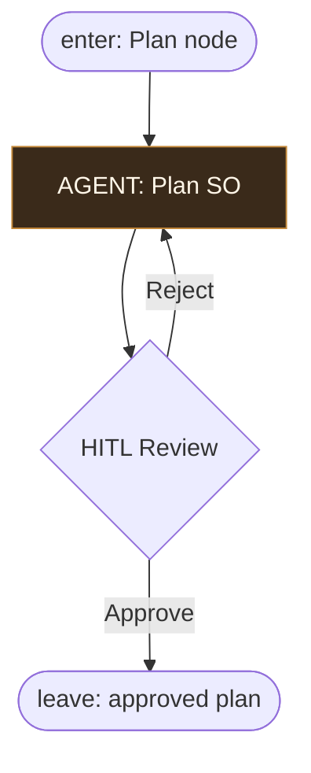

# Subgraph: plan-hitl

**Theme:** Plan box (LLM) + Review hexagon (HITL).  
**Mode mix:** AGENT + HITL.

## Flow

```mermaid
flowchart TD
  A([enter: Plan node]) --> P[AGENT: Plan SO]
  P --> R{HITL Review}
  R -->|Reject| P
  R -->|Approve| OK([leave: approved plan])

  classDef agent fill:#3a2a1a,stroke:#c4893a,color:#fff6e8
  class P agent
```

## Notes

- Review ≠ LLM-judge merge.
- Approve odblokowuje Implement w fixed DOT.
