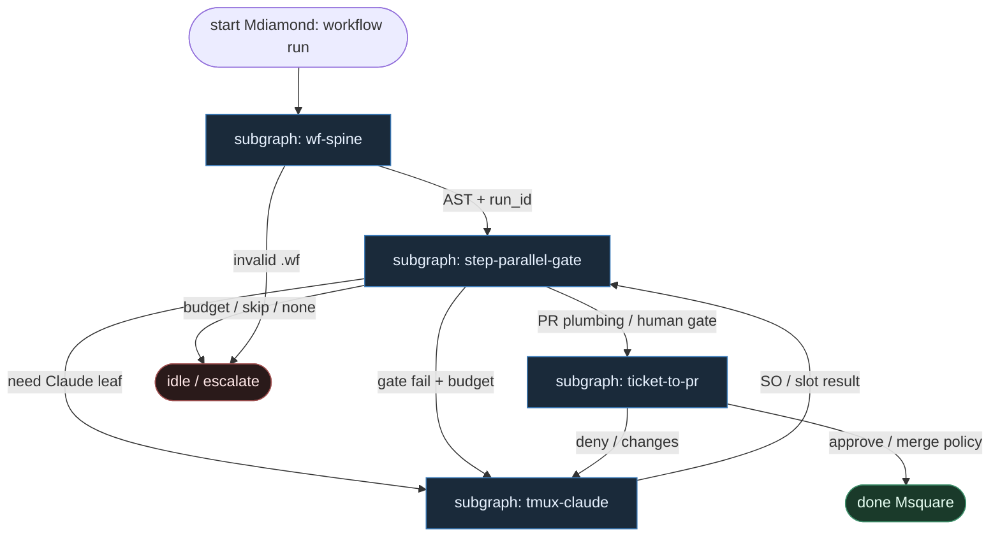

# 44 — WF DSL (artushin / conductor-ai)

**Persona:** wf-dsl compose — [artushin/conductor-ai](https://github.com/artushin/conductor-ai) (upstream [devinrosen/conductor-ai](https://github.com/devinrosen/conductor-ai)): **silnik `.wf` DSL** włada krokami i bramkami; **Claude tylko w slotach tmux**.

**Approach:** compose. Mapowanie instance `artushin-conductor-ai` (SPINE_INDEX `spine_deterministic`, conf 80) na duszę klepacza: ticket→PR, local-first, nie L5. **Nie** Microsoft Conductor (YAML+Jinja) — to wariant [`24-conductor-yaml`](../24-conductor-yaml/).

## Design notes

- **`.wf` jest programem.** `conductor workflow run ticket-to-pr <repo> <wt> --input ticket_id=N` — topologia steps / parallel / gate żyje w DSL, nie w chat-loopie modelu. Zmiana procesu = diff `.wf` + review.
- **Silnik włada next-step.** Parser + executor (Rust + SQLite pod `~/.conductor/`) ocenia kolejność, fan-in/out `parallel`, wynik `gate`. **0 tokenów orkiestracji.**
- **Claude = slot tmux.** Liść entropii: plan / implement / review / bounded-fix w oknie tmux (Claude Code). Zwraca structured output; **nie** wybiera następnego kroku `.wf`, **nie** woła merge.
- **Gate = DET lub HITL.** Automated (testy, schema SO) albo human gate w TUI/CLI. Model nie jest sędzią bramki jako jedyny werdykt.
- **Worktree + sync.** Tickety GitHub/Jira → lokalne worktrees; K=1 occupancy. Meat ≡ AI w tym samym slocie tmux.
- **MCP observatory.** `conductor mcp serve` (~22 tools) + TUI / CLI / web monitor — obs, nie mózg routera.
- **Sufit kodera = open PR.** Push + PR lifecycle w silniku; merge zostaje przy MergePolicy Off|Classify|Always / człowieku. NOT L5.
- **Operator trigger.** Local-first (nie GHA-event spine) — skrypt/daemon może owijać `workflow run`, ale edge ownership zostaje w `.wf`.

## Top-level flowchart

**DET vs AGENT at a glance**

| Layer | Mode | Responsibility |
|-------|------|----------------|
| `.wf` load + schema validate | DET | Parse DSL; reject unknown constructs / LLM-in-route |
| step / parallel / gate executor | DET | Owns next edge; 0 orchestration tokens |
| tickets sync, worktree, git, open_pr | DET | Idempotent I/O under `~/.conductor/` |
| Claude in tmux slot | AGENT leaf | plan / implement / review / fix — SO only |
| gate (auto or human) | DET / HITL | tests, schema, TUI approve — not sole LLM judge |
| MergePolicy Off\|Classify\|Always | DET / HITL | Prod merge button ≠ agent |
| Claude choosing next `.wf` step | — | **FORBIDDEN** |

## Index of subgraphs

| File | Theme | Role in chain |
|------|--------|----------------|
| [subgraph-wf-spine.md](./subgraph-wf-spine.md) | Load + validate `*.wf` | DET front: DSL-is-code |
| [subgraph-step-parallel-gate.md](./subgraph-step-parallel-gate.md) | steps / parallel / gate | Engine owns topology |
| [subgraph-tmux-claude.md](./subgraph-tmux-claude.md) | Claude Code w tmux | Entropy slot; not router |
| [subgraph-ticket-to-pr.md](./subgraph-ticket-to-pr.md) | sync → worktree → PR → HITL | Klepacz ceiling + merge policy |

## Compose map (artushin conductor-ai → klepacz)

| Conductor-ai concept | Klepacz seat |
|----------------------|--------------|
| `conductor workflow run ticket-to-pr` | daemon/script tick: labeled issue → one run |
| `.wf` steps / parallel / gate | fixed DET FSM ticket→PR (nie department brain) |
| Rust + SQLite under `~/.conductor/` | local run state + worktree registry |
| Claude in tmux window | plan_issue / implement / pr_review / repair SO leaves |
| Gate step (auto) | pytest / schema validate / CI poll |
| Gate step (human) | TUI/CLI approve; MergePolicy Off |
| tickets sync GitHub/Jira | DET intake + claim K=1 |
| worktree link | occupancy + sandbox przed tmux |
| `conductor mcp serve` | obs / tool surface — nie router |
| Push + open PR | DET coder ceiling |
| LLM as `.wf` router | **FORBIDDEN** |
| microsoft/conductor YAML+Jinja | **out of scope** → `24-conductor-yaml` |

## Kryterium sukcesu

Człowiek ma energię na architekturę i niewygodne pytania — bo kolejność kroków i bramki nie spalają tokenów ani dnia w „co dalej?”. Technicznie: `workflow run` prowadzi `.wf` do otwartego (i opcjonalnie zmergowanego) `ai/…` PR; Claude w tmux nigdy nie wybiera następnego kroku DSL.
