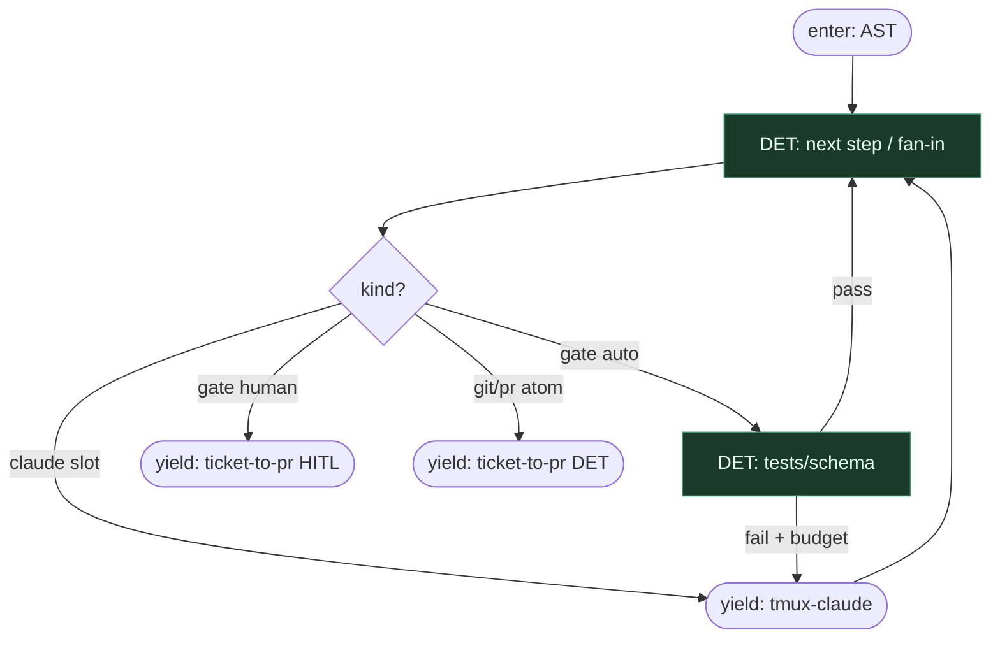

# Subgraph: step-parallel-gate

**Theme:** Engine owns steps / parallel / gate.  
**Mode mix:** 100% DET orchestration.

## Flow

## Notes

- 0 orchestration tokens.
- Claude never chooses next `.wf` step.
