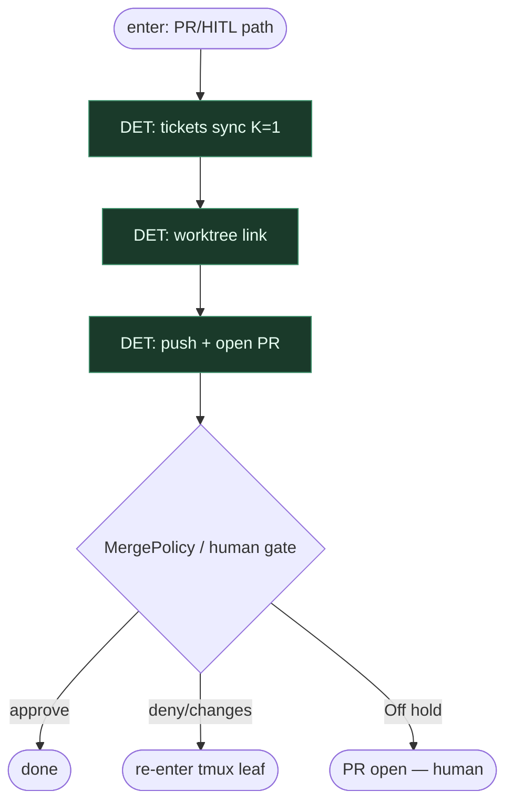

# Subgraph: ticket-to-pr

**Theme:** sync → worktree → PR → HITL / merge policy.  
**Mode mix:** DET + HITL.

## Flow

```mermaid
flowchart TD
  A([enter: PR/HITL path]) --> SY[DET: tickets sync K=1]
  SY --> WT[DET: worktree link]
  WT --> PR[DET: push + open PR]
  PR --> M{MergePolicy / human gate}
  M -->|approve| D([done])
  M -->|deny/changes| BACK([re-enter tmux leaf])
  M -->|Off hold| H([PR open — human])

  classDef det fill:#1a3a2a,stroke:#3d8f6a,color:#e8fff3
  class SY,WT,PR det
```

## Notes

- Sufit kodera = open PR.
- MCP observatory = obs, nie mózg.
