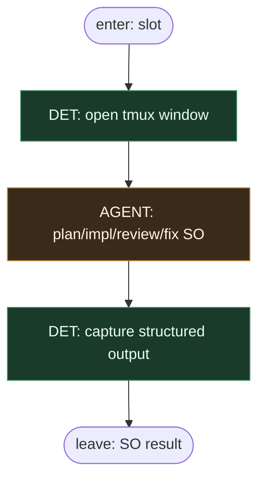

# Subgraph: tmux-claude

**Theme:** Claude Code w slocie tmux — SO only.  
**Mode mix:** AGENT leaf.

## Flow

```mermaid
flowchart TD
  A([enter: slot]) --> S[DET: open tmux window]
  S --> C[AGENT: plan/impl/review/fix SO]
  C --> O[DET: capture structured output]
  O --> OK([leave: SO result])

  classDef det fill:#1a3a2a,stroke:#3d8f6a,color:#e8fff3
  classDef agent fill:#3a2a1a,stroke:#c4893a,color:#fff6e8
  class S,O det
  class C agent
```

## Notes

- Meat ≡ AI w tym samym slocie.
- Nie woła merge; nie routuje `.wf`.
