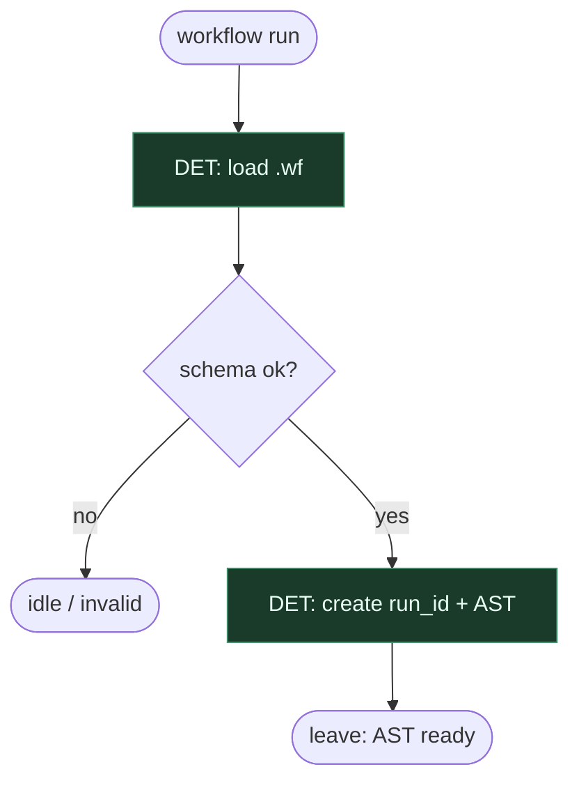

# Subgraph: wf-spine

**Theme:** Load + validate `*.wf`; DSL-is-code.  
**Mode mix:** 100% DET.

## Flow

## Notes

- Zmiana procesu = diff `.wf`, nie chat „dziś inaczej”.
- Reject unknown constructs / LLM-in-route.
