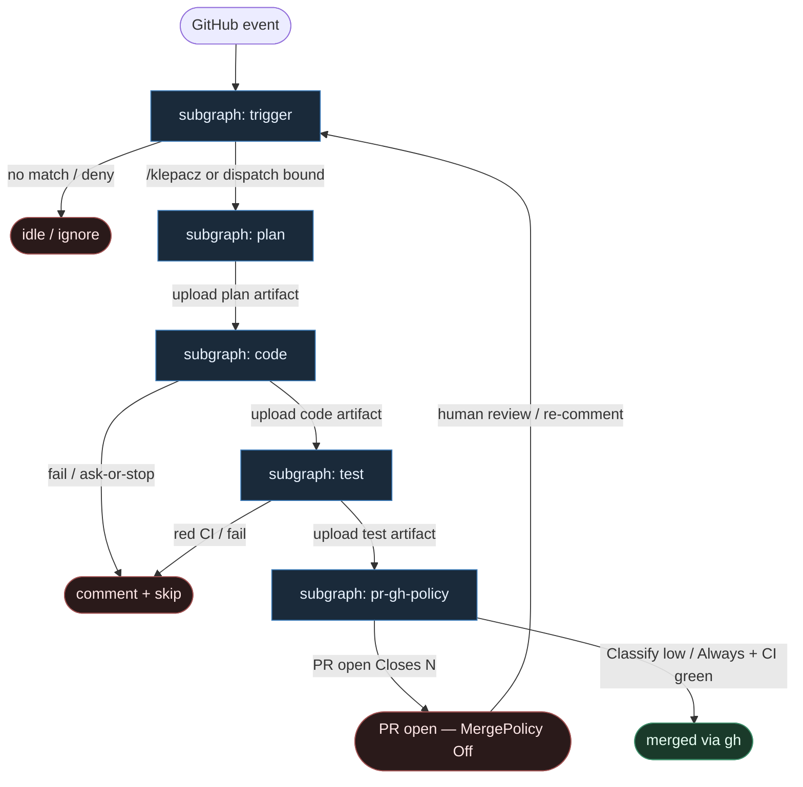

# 45 — GHA-native compose (`issue_comment` / `workflow_dispatch` → plan|code|test|pr)

**Persona:** `gha-native compose` — **GitHub Actions jest programem**: `issue_comment` / `workflow_dispatch` → stałe joby **`plan` → `code` → `test` → `pr`**; handoff wyłącznie przez **artifacts**; merge przez **`gh` + MergePolicy**. Agenty są **liśćmi wewnątrz kroków** `plan` / `code`, nie routerem YAML.

**Approach:** `compose`. Nie budujemy osobnego orkiestratora poza GHA — `needs:`, `upload-artifact` / `download-artifact` i `gh` to kręgosłup DET-majority zgodny z SOUL / KLEPACZ.

## Design notes

- **`issue_comment` / `workflow_dispatch` = start.** Slash (`/klepacz`, `/plan`, `/do`) na issue albo ręczny dispatch z `issue_number` (+ opc. `merge_policy`). Zero agent pick z czatu / unlabeled backlogu.
- **Jobs = spine.** Cztery joby w YAML: `plan` → `code` (`needs: plan`) → `test` (`needs: code`) → `pr` (`needs: test`). Kolejność stała; LLM nie dopisuje `jobs:` ani `needs:`.
- **Artifacts = jedyny handoff.** `plan` uploaduje `plan.json`; `code` downloaduje plan, uploaduje patch/branch meta; `test` downloaduje code, uploaduje raport; `pr` downloaduje test + code meta → `gh pr create`. Żadnego „pamiętania” w modelu między jobami.
- **AGENT tylko w liściach plan/code.** Plan SO / implement SO (albo Claude/Codex leaf w kroku). Job `test` = skrypt / CI runner (DET). Job `pr` = `gh` DET.
- **Coder ceiling = open PR.** Merge = `gh pr merge` pod Off|Classify|Always (domyślnie **Off**).
- **Branch `klepacz/issue-N`.** K=1 occupancy per ticket; runner = świeża komórka.
- **Meat ≡ AI.** To samo siedzenie; graf bez zmian gdy liść wypełnia człowiek-klepacz vs model.
- **NOT L5.** Zdejmujemy babysitting ticket→branch→push→PR w Actions. Nie lights-out bank.
- **Cel (SOUL):** energia na architekturę i niewygodne pytania QA — nie na klepanie GHA ręcznie.

## Top-level flowchart

**DET vs AGENT at a glance**

| Layer | Mode | Skąd (compose) | Uwaga |
|-------|------|----------------|-------|
| `issue_comment` / `workflow_dispatch` | DET | GHA `on:` + `if:` | agent nie wybiera pracy |
| job `needs:` chain | DET | fixed workflow YAML | spine bez LLM |
| `upload`/`download-artifact` | DET | Actions artifacts | jedyny handoff |
| plan step (SO / leaf) | AGENT leaf | wewnątrz job `plan` | entropy plan |
| code step (SO / leaf) | AGENT leaf | wewnątrz job `code` | entropy implement |
| test job | DET | script / test runner | nie LLM-judge |
| `gh pr create` | DET | job `pr` | coder ≠ merge |
| `gh pr merge` + Off\|Classify\|Always | DET policy | KLEPACZ | default Off |

## Index of subgraphs

| File | Theme | Role in chain |
|------|--------|----------------|
| [subgraph-trigger.md](./subgraph-trigger.md) | `issue_comment` / `workflow_dispatch` | DET trigger gate |
| [subgraph-plan.md](./subgraph-plan.md) | job `plan` + plan artifact | AGENT leaf → artifact |
| [subgraph-code.md](./subgraph-code.md) | job `code` + code artifact | AGENT leaf → branch/patch |
| [subgraph-test.md](./subgraph-test.md) | job `test` + test artifact | DET verify |
| [subgraph-pr-gh-policy.md](./subgraph-pr-gh-policy.md) | job `pr` + `gh` merge policy | coder ceiling; merge DET/human |

## Mapowanie GHA-native → klepacz

| GHA native | Klepacz seat |
|------------|--------------|
| `on: issue_comment` / `workflow_dispatch` | subgraph-trigger |
| job `plan` + `upload-artifact` | subgraph-plan |
| job `code` `needs: plan` + download/upload | subgraph-code |
| job `test` `needs: code` | subgraph-test |
| job `pr` `needs: test` + `gh pr create` | subgraph-pr-gh-policy |
| `gh pr merge` + policy input/secret | MergePolicy Off\|Classify\|Always |
| agent as `jobs:` router | **FORBIDDEN** |

## Antyteza (czego tu nie ma)

- Agent wybierający pracę z czatu / unlabeled backlogu
- LLM dopisujący joby / `needs:` / nazwę artifactu
- Handoff „w pamięci modelu” między runnerami (zamiast artifacts)
- Merge z liścia code bez `gh` + policy
- L5 lights-out / wymyślanie ticketów
- Monolit: jeden job „zrób wszystko”

## Kryterium sukcesu

Technicznie: artifacts `plan`→`code`→`test`→ otwarty (opc. zmergowany przez `gh`) PR `Closes #N` na tipie hosta. Ludzko: inżynier nie babysittował ticket→PR w Actions — energia na architekturę i niewygodne pytania QA.
