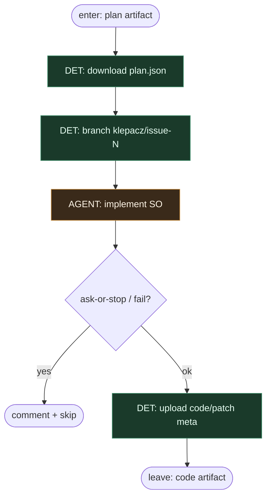

# Subgraph: code

**Theme:** job `code` `needs: plan` — implement leaf + code artifact.  
**Mode mix:** DET + AGENT.

## Flow

```mermaid
flowchart TD
  A([enter: plan artifact]) --> D[DET: download plan.json]
  D --> B[DET: branch klepacz/issue-N]
  B --> I[AGENT: implement SO]
  I --> F{ask-or-stop / fail?}
  F -->|yes| S([comment + skip])
  F -->|ok| U[DET: upload code/patch meta]
  U --> OK([leave: code artifact])

  classDef det fill:#1a3a2a,stroke:#3d8f6a,color:#e8fff3
  classDef agent fill:#3a2a1a,stroke:#c4893a,color:#fff6e8
  class D,B,U det
  class I agent
```

## Notes

- K=1 occupancy; świeża komórka runnera.
- Coder ≠ merge.
