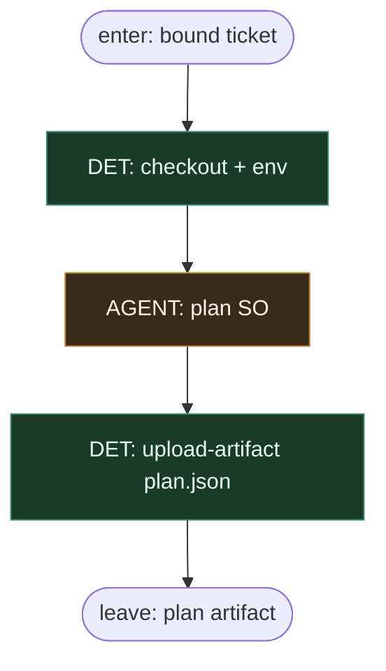

# Subgraph: plan

**Theme:** job `plan` — AGENT leaf + `plan.json` artifact.  
**Mode mix:** DET job shell + AGENT leaf.

## Flow

## Notes

- LLM nie dopisuje `jobs:` / `needs:`.
- Jedyny handoff dalej = artifact.
