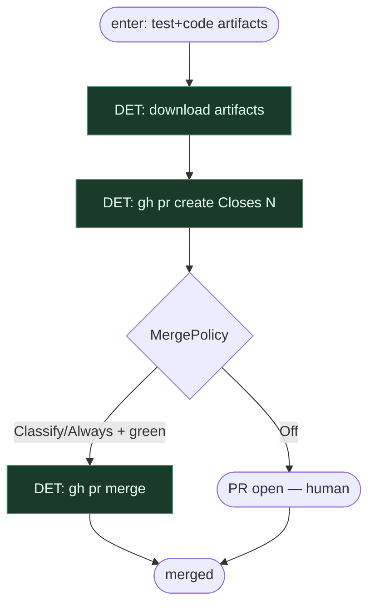

# Subgraph: pr-gh-policy

**Theme:** job `pr` — `gh pr create` + MergePolicy.  
**Mode mix:** DET (+ HITL gdy Off).

## Flow

## Notes

- Default Off.
- Merge tylko przez `gh` + policy — nie z liścia code.
