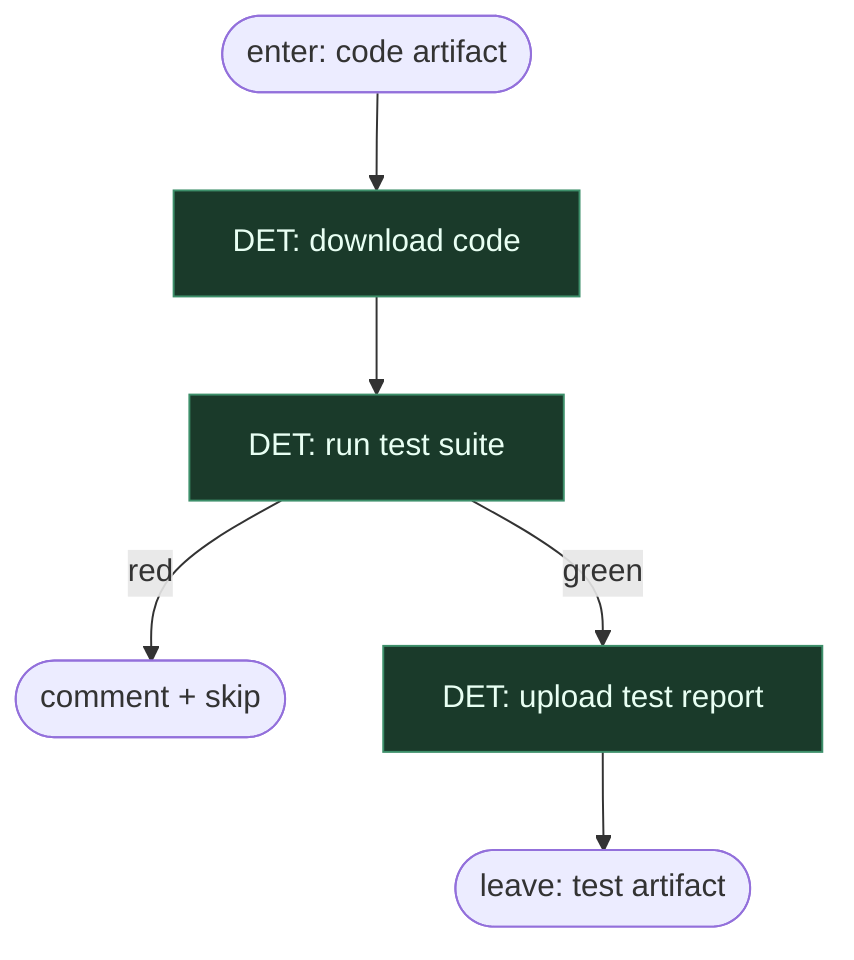

# Subgraph: test

**Theme:** job `test` — DET verify + test artifact.  
**Mode mix:** 100% DET.

## Flow

```mermaid
flowchart TD
  A([enter: code artifact]) --> D[DET: download code]
  D --> T[DET: run test suite]
  T -->|red| S([comment + skip])
  T -->|green| U[DET: upload test report]
  U --> OK([leave: test artifact])

  classDef det fill:#1a3a2a,stroke:#3d8f6a,color:#e8fff3
  class D,T,U det
```

## Notes

- Nie LLM-judge.
- Fail closed → skip, nie limbo.
