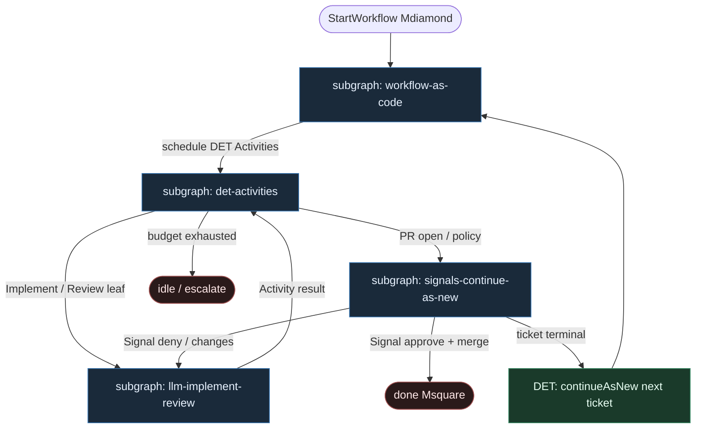

# 46 — Temporal Klepacz (Workflow-as-code)

**Persona:** temporal-klepacz compose — [Temporal](https://temporal.io/): Workflow-as-code + Activities; Signals for HITL; `continueAsNew` per ticket; LLM **tylko** w Activities Implement / Review.

**Approach:** compose. Czysty Temporal (nie dual Inngest z [`15-durable-steps`](../15-durable-steps/); nie Inngest-only z [`31-inngest-steps`](../31-inngest-steps/)). Durability = Event History; orkiestracja = DET kod Workflow; entropia = dwa Activity leave'y.

## Design notes

- **Workflow jest kodem DET.** Ciało Workflow (TS/Go/Python SDK): `proxyActivities`, kolejność, diamenty budżetu, `waitCondition` na sygnałach. Zero LLM w ciele — replay Event History wymaga determinizmu.
- **Activities = jednostka retry.** `ActivityOptions` (startToCloseTimeout, retry) per krok. Padnięty `runTests` nie rehydratuje issue; padnięty `openPr` nie re-implementuje.
- **LLM tylko Implement + Review.** Plan = DET (hydrate issue → checklist / template z body / labels) — **nie** agent leaf. Implement i Review to osobne Activities (reviewer ≠ implementer). Repair po fail testów = ponowne wywołanie Implement Activity z `failure_log` (bounded).
- **HITL = Signals.** `defineSignal("approve"|"deny"|"changes_requested")` + `workflow.waitCondition`. Misja śpi w Temporal; nie w RAM agenta. MergePolicy Off|Classify|Always to DET.
- **`continueAsNew` per ticket.** Po terminalu ticketa (done / escalate / skip) Workflow robi CAN z następnym `ticketId` (albo kończy run i worker startuje nowy) — świeża historia, bez bloatu Event History przy długich pętlach napraw / kolejce.
- **Meat ≡ AI w tym samym slocie.** Ten sam contract Activity; silnik nie rozróżnia kto wypełnił SO.
- **Jeden ticket, jeden PR.** K=1; occupancy/worktree = DET Activities przed Implement.
- **NOT L5.** Cel: zdjąć wyczerpujące klepanie; merge zostaje przy polityce / człowieku.

## Top-level flowchart



**DET vs AGENT at a glance**

| Layer | Mode | Responsibility |
|-------|------|----------------|
| Workflow body | DET | Order, budget, signals, continueAsNew; replay-safe |
| Event History | DET | Source of truth; resume without re-prompting world |
| hydrate, plan_template, worktree, test, git, open_pr, merge | DET Activity | Idempotent I/O; Activity-scoped retries |
| Implement / Review | AGENT inside Activity | LLM fills SO only; **not** Plan; not router |
| defineSignal + waitCondition | HITL | Human / CI — not LLM as sole merge gate |
| agent as graph router | — | **FORBIDDEN** |

## Index of subgraphs

| File | Theme | Role in chain |
|------|--------|----------------|
| [subgraph-workflow-as-code.md](./subgraph-workflow-as-code.md) | Temporal Workflow body | DET durable spine + history |
| [subgraph-det-activities.md](./subgraph-det-activities.md) | CODE Activities: pick→PR plumbing | Activity retries, idempotency |
| [subgraph-llm-implement-review.md](./subgraph-llm-implement-review.md) | LLM only Implement + Review | Entropy slots; Plan is DET |
| [subgraph-signals-continue-as-new.md](./subgraph-signals-continue-as-new.md) | Signals HITL + CAN per ticket | Durable wait → done / next ticket |

## Compose map (Temporal → klepacz)

| Temporal concept | Klepacz seat |
|------------------|--------------|
| `StartWorkflow(ticketId)` | label `ready-for-agent` → one run per ticket (or worker + CAN) |
| Workflow body | fixed FSM ticket→PR (nie department brain) |
| `proxyActivities` CODE | hydrate, plan_template, worktree, test, commit, push, open_pr, merge_policy |
| Activity Implement / Review | **only** LLM seats |
| Event History | checkpoint po każdym Activity completion |
| Activity retry policy | bounded infra retry; semantic repair = new Implement call |
| `defineSignal` + `waitCondition` | MergePolicy Off / human approve\|deny\|changes |
| `continueAsNew` | per-ticket history bound / next issue |
| `defineQuery("status")` | opcjonalny podgląd bez LLM |
| LLM w Workflow body / Plan Activity | **FORBIDDEN** |

## Pseudo-szkielet (ilustracja)

```ts
const approve = defineSignal<[Verdict]>("approve");
const deny = defineSignal<[string]>("deny");
const changes = defineSignal<[string]>("changes_requested");

export async function klepaczTicket(ticketId: string): Promise<void> {
  const a = proxyActivities<DetActs>({ startToCloseTimeout: "10m", retry: { maximumAttempts: 3 } });
  const llm = proxyActivities<LlmActs>({ startToCloseTimeout: "30m", retry: { maximumAttempts: 1 } });

  const issue = await a.hydrate(ticketId);
  const plan = await a.planTemplate(issue); // DET — nie LLM
  const wt = await a.claimWorktree(issue);
  await llm.implement({ plan, wt, issue }); // LLM leaf
  let tests = await a.runTests(wt);
  for (let i = 0; i < 2 && !tests.ok; i++) {
    await llm.implement({ plan, wt, issue, failure_log: tests.log }); // bounded repair
    tests = await a.runTests(wt);
  }
  const pr = await a.openPr(wt, issue);
  await llm.review({ pr, issue }); // LLM leaf — osobna Activity
  let verdict: Verdict | null = null;
  setHandler(approve, (v) => { verdict = v; });
  setHandler(deny, () => { verdict = "deny"; });
  setHandler(changes, () => { verdict = "changes"; });
  const policy = await a.mergePolicy(pr);
  if (policy === "Off" || policy === "ClassifyHigh") {
    await condition(() => verdict !== null, "7 days");
  }
  if (verdict === "approve" || policy === "Always") await a.merge(pr);
  // continue-as-new per ticket (worker queue) — or return and let starter fire next
  // await continueAsNew<typeof klepaczTicket>(nextTicketId);
}
```

## Kryterium sukcesu

Człowiek ma energię na architekturę — bo misja przeżywa restarty, czeka na Signal bez spalania tokenów, a LLM nie orkiestruje. Technicznie: Event History → otwarty (i opcjonalnie zmergowany) `ai/PR`; Plan DET; LLM tylko Implement/Review; CAN trzyma historię przy kolejnych ticketach.
