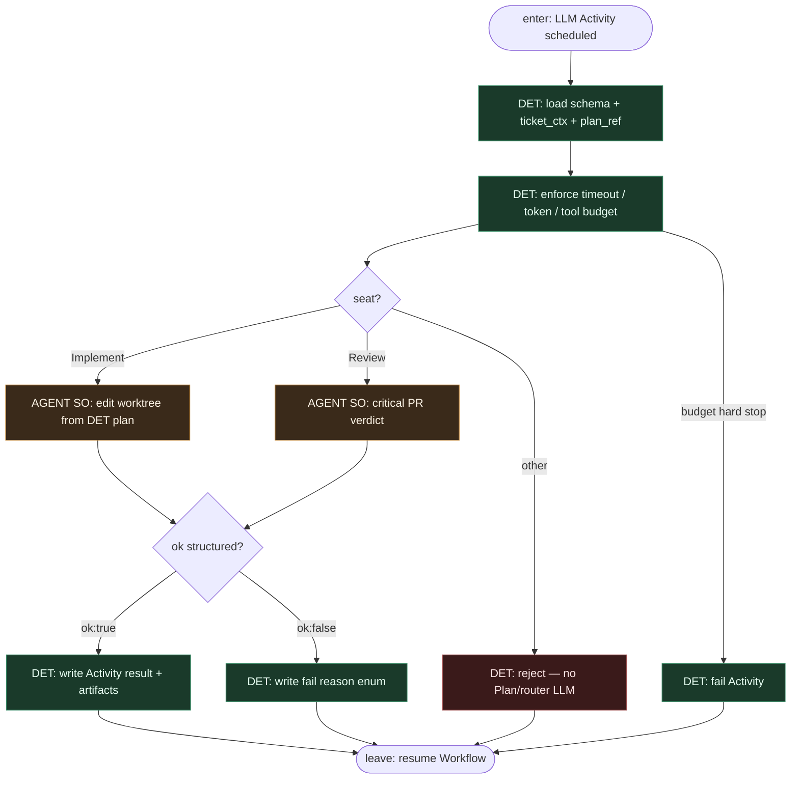

# Subgraph: llm-implement-review

**Theme:** LLM **tylko** w Activities Implement i Review — wypełnia SO; nie routuje Workflow; Plan nie jest agent leaf.  
**Mode mix:** AGENT leaf ×2. Workflow decyduje *kiedy*; Activity *jak* w budżecie.

## Flow

## Notes

- **Narrower than 15.** Brak plan / generic llm-activity. Tylko Implement + Review.
- **Not a router.** Model nie wybiera następnego Activity, nie woła Signal, nie decyduje merge.
- **Repair = Implement again.** Po `runTests` fail Workflow planuje **kolejne** wywołanie Implement z `failure_log` — bounded N; nie „agent napraw świat”.
- **Reviewer ≠ implementer.** Osobna Activity, osobny prompt/schema — nawet gdy ten sam vendor modelu.
- **Meat ≡ AI.** Ten sam schema seat.
- **Handoff.** Leave = `{seat, ok, artifact_ref, reason?, usage}`.
