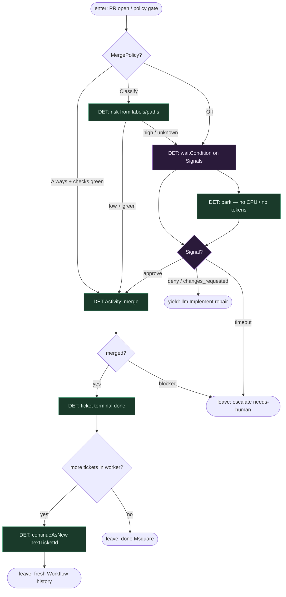

# Subgraph: signals-continue-as-new

**Theme:** Durable HITL przez Temporal Signals; MergePolicy Off|Classify|Always; `continueAsNew` jako granica ticketa.  
**Mode mix:** HITL Signals + DET policy + DET CAN.

## Flow

## Notes

- **Signals, not Inngest waitForEvent.** `defineSignal("approve"|"deny"|"changes_requested")` + `workflow.waitCondition` / `condition`. Opcjonalnie `defineUpdate` dla synchronicznego HITL.
- **Wait is durable.** Misja śpi w Temporal; Event History trzyma park — zero tokenów na orkiestrację.
- **Policy is CODE.** Off|Classify|Always = atom DET (KLEPACZ.md). LLM Review komentuje; nie jest jedyną bramką merge.
- **CAN per ticket.** Po done/escalate/skip: `continueAsNew(nextTicketId)` albo return + nowy `StartWorkflow`. Cel: świeża historia per ticket, bez bloatu przy kolejce / repair loops.
- **Changes → bounded Implement.** Deny nie restartuje od hydrate; Workflow woła Implement z review comments.
- **Handoff.** Leave done = `{pr, merged_sha}`; escalate = `{reason, pr_url}`; CAN = `{nextTicketId}`; yield Implement = `{comments, attempt}`.
