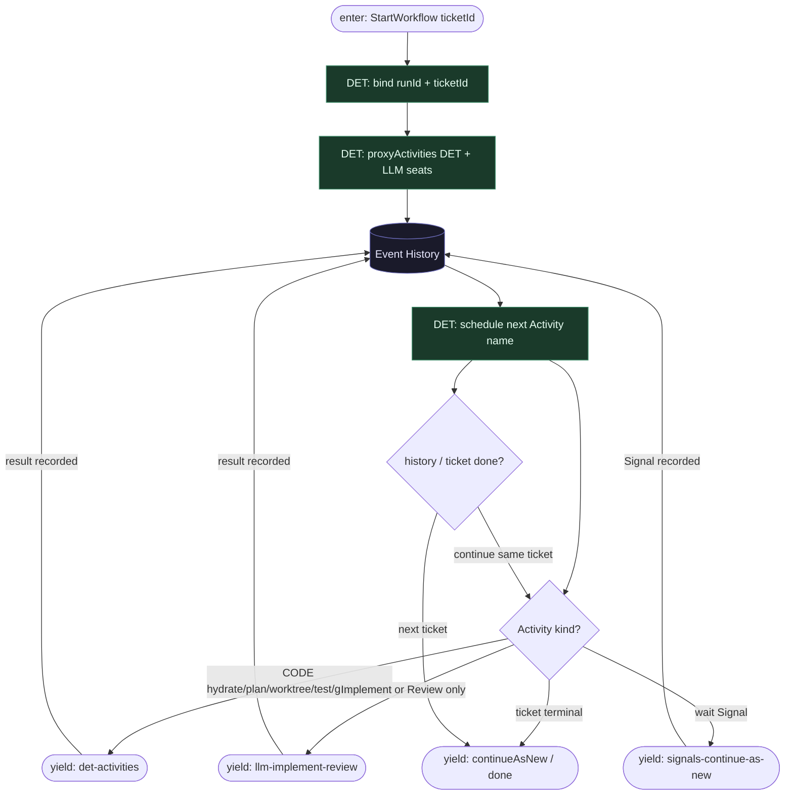

# Subgraph: workflow-as-code

**Theme:** Temporal Workflow = deterministyczny kod; Event History = źródło prawdy; `proxyActivities` = jedyny I/O.  
**Mode mix:** DET only. Zero LLM w ciele Workflow.

## Flow

## Notes

- **Replay-safe.** Workflow czyta historię + wyniki Activities. Żadnych zegarów wall-clock / LLM / niestabilnych map w ciele (Temporal nondeterminism).
- **Orkiestrator nie myśli.** Kolejność klepacza stała: hydrate → planTemplate(DET) → worktree → implement → test → (repair×N) → openPr → review → signal/policy → merge|CAN.
- **Durability ≠ agent memory.** Context window modelu nie jest stanem misji.
- **One Workflow occupancy per ticket.** K=1 egzekwowane DET Activity przed Implement.
- **Handoff.** Yield det = `{activity, idempotency_key, input_ref}`; yield llm = `{seat: implement|review, attempt, ctx}`; yield hitl = `{signals, pr_ref, policy}`.
