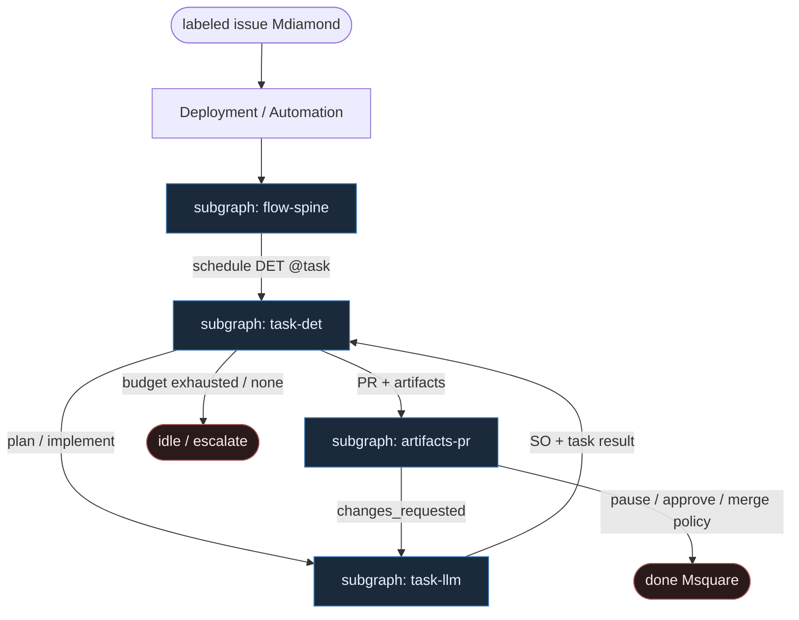

# 47 — Prefect Flow (`@flow` / `@task` compose)

**Persona:** prefect-flow compose — [Prefect](https://www.prefect.io/): `@flow` = DET spine; `@task` = atom z retries/persist; **Deployment** startuje z labeled issue; LLM **tylko** w `@task` plan/impl; **artifacts** + **PR ceiling**.

**Approach:** compose. Czysty Prefect (nie dual Temporal [`15`](../15-durable-steps/) ani Inngest [`31`](../31-inngest-steps/)). Mapowanie flow/task/deployment/artifact na duszę klepacza (ticket→PR, nie L5).

## Design notes

- **Deployment z labela.** `issues.labeled: ready-for-agent` → Automation → Deployment → flow run z `issue_id`. Agent nie wybiera pracy z czatu.
- **`@flow` jest DET.** Ciało flow = kolejność tasków, `if` na wynikach, budżet napraw, `pause_flow_run`. Zero LLM w orkiestracji.
- **`@task` = jednostka retry/persist.** Padnięty `run_tests` nie rehydratuje; padnięty `open_pr` nie re-implementuje. `cache_key_fn` / `persist_result` = checkpoint.
- **LLM tylko plan + impl.** `plan_issue` i `implement` to jedyne `@task` z modelem. Brak LLM-review jako sędziego merge; review = HITL / osobna rola po PR.
- **Artifacts = obserwowalność.** `create_markdown_artifact(plan)`, `create_link_artifact(pr_url)` — UI Prefect, nie router grafu.
- **Coder ceiling = open PR.** Po `open_pr` LLM nie merge'uje; MergePolicy Off|Classify|Always + człowiek.
- **Meat ≡ AI.** Ten sam contract taska; silnik nie rozróżnia kto wypełnił SO.
- **K=1.** Jeden flow run / jeden worktree / jeden PR per issue.
- **NOT L5.** Zdjąć klepanie; merge zostaje przy polityce / człowieku.

## Top-level flowchart



**DET vs AGENT at a glance**

| Layer | Mode | Responsibility |
|-------|------|----------------|
| Deployment + Automation | DET | Label → flow run; bind `issue_id` |
| `@flow` body | DET | Order, budget diamonds, pause/resume |
| Task result store | DET | Persist / cache; resume without re-prompt |
| hydrate, claim, worktree, test, git, open_pr, merge | DET `@task` | Idempotent I/O; task-scoped retries |
| plan_issue / implement | AGENT `@task` only | LLM fills leaf; structured output |
| artifacts | DET observe | Markdown/link in Prefect UI — not edges |
| pause_flow_run / MergePolicy | HITL | Human owns merge when Off |
| agent as flow router | — | **FORBIDDEN** |

## Index of subgraphs

| File | Theme | Role in chain |
|------|--------|----------------|
| [subgraph-flow-spine.md](./subgraph-flow-spine.md) | `@flow` + Deployment z labela | DET durable spine |
| [subgraph-task-det.md](./subgraph-task-det.md) | CODE `@task`: pick→PR plumbing | Task retries, K=1 |
| [subgraph-task-llm.md](./subgraph-task-llm.md) | LLM `@task` **tylko** plan/impl | Entropy slot; not router |
| [subgraph-artifacts-pr.md](./subgraph-artifacts-pr.md) | Artifacts + PR ceiling + HITL | Observability → done |

## Compose map (Prefect → klepacz)

| Prefect concept | Klepacz seat |
|-----------------|--------------|
| Automation on `issues.labeled` | label `ready-for-agent` → one Deployment run |
| `@flow` body | fixed FSM ticket→PR |
| `@task` CODE | hydrate, claim, worktree, test, commit, push, open_pr, merge_policy |
| `@task` LLM | **only** `plan_issue` / `implement` |
| `persist_result` / cache | checkpoint po tasku |
| task `retries=` | bounded infra retry; fail closed |
| `create_*_artifact` | plan + PR link w UI |
| `pause_flow_run` | MergePolicy Off / human approve |
| LLM w `@flow` body | **FORBIDDEN** |
| LLM review as sole merge gate | **FORBIDDEN** (ceiling = open PR) |

## Pseudo-szkielet (ilustracja)

```python
from prefect import flow, task, pause_flow_run
from prefect.artifacts import create_markdown_artifact, create_link_artifact

@task(retries=2, persist_result=True)
def hydrate(issue_id): ...

@task
def plan_issue(issue):  # LLM leaf ONLY
    return plan_so(issue)

@task
def implement(plan, wt):  # LLM leaf ONLY
    return impl_so(plan, wt)

@task(retries=2)
def open_pr(wt, issue): ...

@flow(name="klepacz-ticket-to-pr")
def klepacz_ticket_to_pr(issue_id: int):
    issue = hydrate(issue_id)
    wt = claim_worktree(issue)          # DET
    plan = plan_issue(issue)            # LLM
    create_markdown_artifact(plan.md, key="plan")
    implement(plan, wt)                 # LLM
    tests = run_tests(wt)               # DET
    if not tests.ok and attempts_left:
        implement(repair_ctx(tests), wt)  # bounded re-entry same LLM seat
    pr = open_pr(wt, issue)             # DET — coder ceiling
    create_link_artifact(pr.url, key="pr")
    pause_flow_run(wait_for_input=Approval)  # HITL
    merge_policy(pr)                    # DET Off|Classify|Always

# Deployment: trigger on GitHub label ready-for-agent → parameters={"issue_id": N}
```

## Kryterium sukcesu

Człowiek ma energię na architekturę — bo Deployment + `@flow` zdejmują klepanie, a LLM nie orkiestruje. Technicznie: flow-run + artifacts prowadzą do otwartego `ai/PR`; merge tylko przez politykę / HITL.
