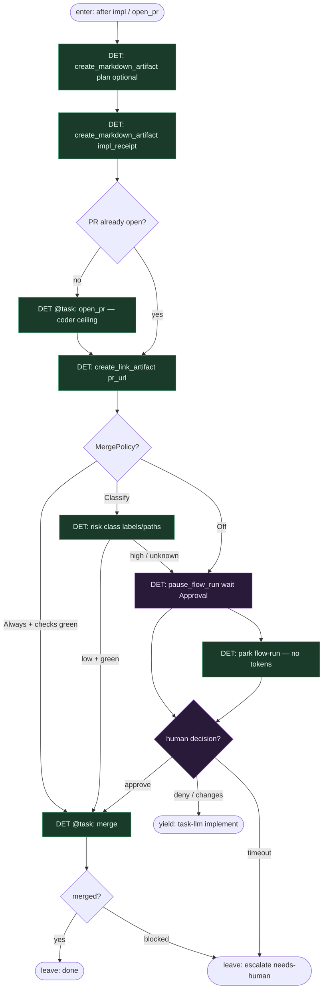

# Subgraph: artifacts-pr

**Theme:** Prefect artifacts + **PR ceiling** + HITL (`pause_flow_run`) + MergePolicy.  
**Mode mix:** DET observe + HITL. LLM nie jest sędzią merge; coder kończy na `open_pr`.

## Flow

## Notes

- **Artifacts ≠ edges.** Markdown/link w Prefect UI = audyt dla człowieka; nie sterują kolejnym `@task`.
- **PR ceiling.** Po `open_pr` kończy się slot implementera. Żadnego LLM-merge, żadnego „agent domyka fabrykę”.
- **Pause is durable.** `pause_flow_run` — misja śpi w Prefect, nie w RAM modelu.
- **Policy is CODE.** Off|Classify|Always jak KLEPACZ.md. Domyślnie Off → człowiek.
- **Changes → bounded re-entry.** Deny nie restartuje Deployment od zera; `@flow` woła ponownie `implement` z komentarzami (budżet N).
- **Handoff.** Leave done = `{pr, merged_sha?, artifact_keys}`; escalate = `{reason, pr_url}`; yield task-llm = `{review_comments, attempt}`.
