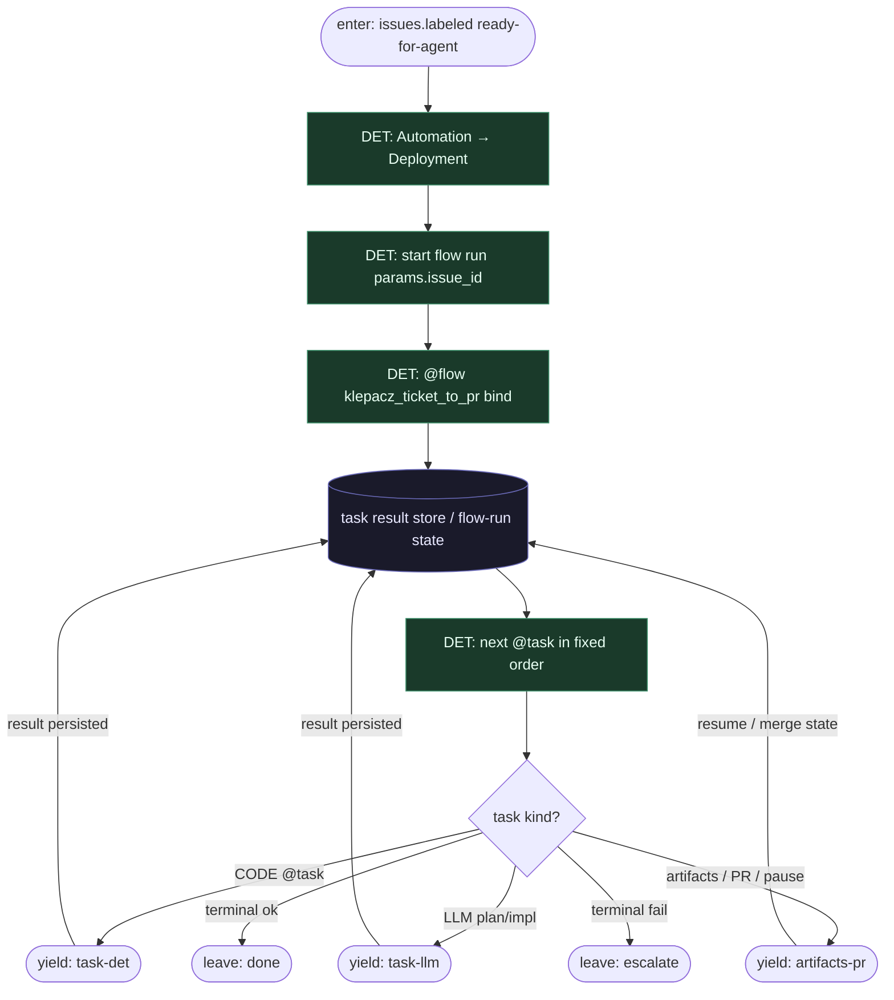

# Subgraph: flow-spine

**Theme:** Prefect Deployment (labeled issue) → `@flow` = deterministyczny szkielet; task results = źródło prawdy.  
**Mode mix:** DET only. Zero LLM w ciele `@flow` (poza wnętrzem LLM `@task`).

## Flow

## Notes

- **Label = start, nie chat-pick.** Automation na `ready-for-agent` tworzy flow run. Agent nie skanuje boardu w `@flow`.
- **Flow body = czysta kontrola.** Kolejność: hydrate → claim/worktree → plan → implement → tests → (bounded repair) → open_pr → artifacts → pause → merge_policy.
- **Replay mental model.** Po restarcie workera Prefect wznawia od nieukończonych tasków; `persist_result` pomija udane.
- **Orkiestrator nie myśli.** `next @task` = stała kolejność klepacza + diamenty budżetu — nie tool-calling router.
- **One flow run per ticket.** K=1 egzekwowane w DET claim/worktree.
- **Handoff.** Yield task-det = `{task_name, issue_id, idempotency_key, input_ref}`; yield task-llm = `{task_name: plan|implement, schema, ticket_ctx, attempt}`; yield artifacts-pr = `{pr_ref, artifact_keys, policy}`.
