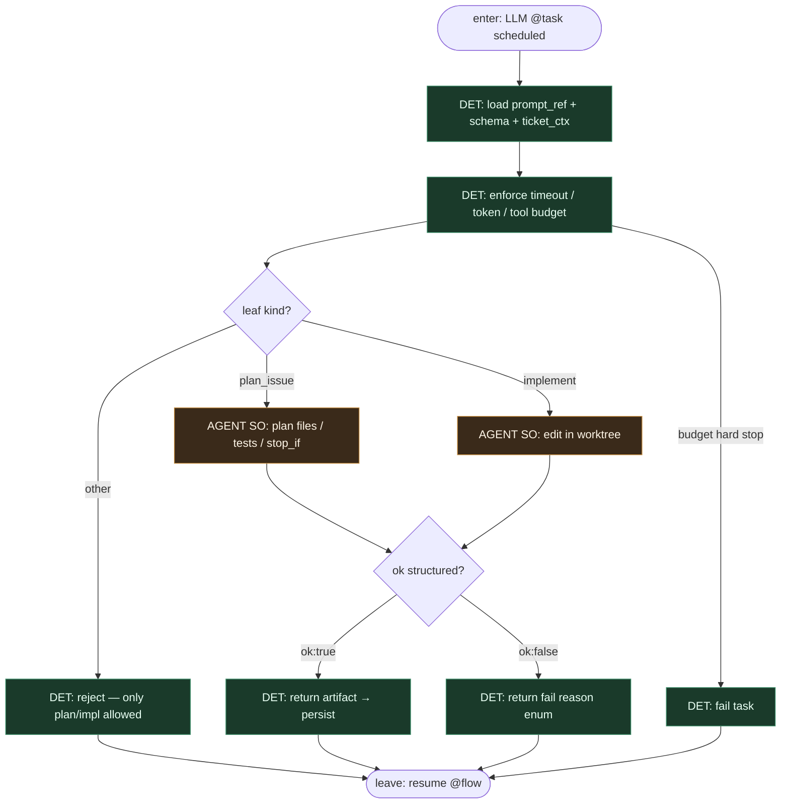

# Subgraph: task-llm

**Theme:** LLM siedzi **tylko** w `@task` `plan_issue` / `implement` — wypełnia SO; nie routuje `@flow`.  
**Mode mix:** AGENT leaf only (plan|impl). Brak LLM-review w tym wariancie jako sędziego.

## Flow

## Notes

- **Only plan + implement.** Invariant wariantu 47: żadnego LLM `@task` na review/merge/routing. Review po PR = człowiek / osobna rola.
- **Not a router.** Model nie woła Deployment, nie przestawia labeli, nie decyduje o merge, nie wybiera „co dalej”.
- **One task, one leaf.** `plan_issue` i `implement` = osobne `@task` (osobne persist). Repair = ponowne `implement` z `failure_log`, nie nowy „brain”.
- **Structured output.** `ok:true` + artefakt (plan.md / diff receipt) albo `ok:false` + reason enum.
- **Infra retry ≠ blind re-prompt.** Prefect `retries=` na crash; naprawa testów to decyzja `@flow` + nowy call `implement`.
- **Meat ≡ AI.** Ten sam schema seat.
- **Handoff.** Leave = `{task_name, ok, artifact_ref, reason?, usage}` → `@flow` idzie DET ścieżką; opcjonalnie yield artifacts-pr dla planu.
