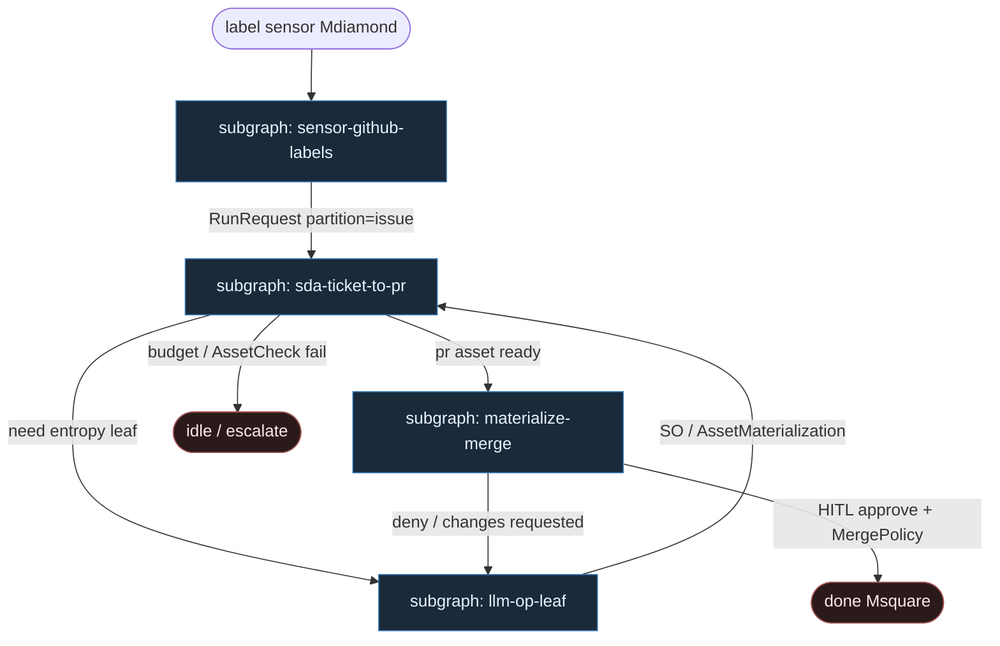

# 48 — Dagster Software-Defined Assets

**Persona:** dagster-assets compose — [Dagster](https://docs.dagster.io/) SDA: `ticket → branch → diff → tests → PR` as **AssetKey** deps; **sensors** na GitHub labels; LLM **tylko** jako op leaf pod assetem.

**Approach:** compose. Orkiestracja = lineage assetów + `RunRequest` z sensora — nie agent-router. Mapowanie SDA na duszę klepacza (ticket→PR, nie L5).

## Design notes

- **Sensor startuje run.** Label `ready-for-agent` (webhook / poll) → `SensorEvaluationContext` → `RunRequest(partition_key=issue_id)`. Agent nie wybiera sobie pracy z czatu.
- **SDA = kręgosłup DET.** `@asset` deps ustalają kolejność: `ticket` → `branch` → `diff` → `tests` → `pr`. Job = `define_asset_job` z fixed selection — LLM nie dokłada AssetKeyów.
- **Materializacja = checkpoint.** Udany `AssetMaterialization` jest prawdą po restarcie; partial fail nie rehydratuje całego łańcucha.
- **LLM = op leaf.** Model siedzi w `compute_fn` assetu `diff` (i opcjonalnie `plan` / `repair`) — wypełnia SO / edytuje worktree. Nie wybiera następnego assetu; wynik `{ok, artifact}` steruje AssetCheck / downstream.
- **`tests` jest DET.** Skrypt / runner CI — nie LLM-as-judge. Fail → bounded `repair` asset (osobny leaf) albo fail-closed.
- **HITL poza modelem.** Approve / MergePolicy Off|Classify|Always — sensor na label `approved` / event; merge to osobny resource, nie op planera.
- **Meat ≡ AI.** Ten sam contract assetu; silnik nie rozróżnia kto wypełnił SO.
- **K=1.** Jedna partycja `issue_id` = jeden branch = jeden PR. Occupancy / worktree = DET asset / resource.
- **NOT L5.** Cel: zdjąć wyczerpujące klepanie; merge zostaje przy polityce / człowieku.

## Top-level flowchart



**DET vs AGENT at a glance**

| Layer | Mode | Responsibility |
|-------|------|----------------|
| GitHub label Sensor + RunRequest | DET | Start; bind `partition_key=issue_id` |
| Asset deps / job selection | DET | Fixed spine ticket→…→pr; replay-safe lineage |
| AssetMaterialization | DET | Checkpoint / source of truth per AssetKey |
| ticket, branch, tests, open_pr, merge_policy | DET asset / resource | Idempotent I/O; AssetChecks |
| plan / diff(implement) / repair / review | AGENT op leaf | LLM fills leaf only; structured output |
| Sensor wait for approve label | HITL | Human / policy — not LLM merge gate |
| LLM as sensor / job router | — | **FORBIDDEN** |

## Index of subgraphs

| File | Theme | Role in chain |
|------|--------|----------------|
| [subgraph-sensor-github-labels.md](./subgraph-sensor-github-labels.md) | Label → Sensor → RunRequest | DET start; no chat pick |
| [subgraph-sda-ticket-to-pr.md](./subgraph-sda-ticket-to-pr.md) | SDA deps ticket→branch→diff→tests→pr | Fixed lineage spine |
| [subgraph-llm-op-leaf.md](./subgraph-llm-op-leaf.md) | LLM inside one asset op | Entropy slot; not router |
| [subgraph-materialize-merge.md](./subgraph-materialize-merge.md) | PR materialize + MergePolicy HITL | Ceiling → done |

## Compose map (Dagster → klepacz)

| Dagster concept | Klepacz seat |
|-----------------|--------------|
| Sensor on `issues/labeled` | label `ready-for-agent` → one run per issue partition |
| `define_asset_job` selection | fixed FSM ticket→PR (nie department brain) |
| `@asset` ticket / branch / tests / pr | DET plumbing: hydrate, worktree, CI, `gh pr create` |
| `@asset` diff (+ plan / repair) | LLM op leaves: implement SO |
| Asset deps | deterministic order; no agent routing |
| AssetMaterialization | checkpoint po każdym AssetKey |
| AssetCheck on `tests` / `pr` | fail-closed gates |
| Sensor / wait for `approved` | MergePolicy Off / human approve |
| Resources (gh, git, llm_client) | IO + leaf wiring; llm_client tylko w leaf ops |
| LLM w sensorze / job factory | **FORBIDDEN** |

## Pseudo-szkielet (ilustracja)

```python
@asset(partitions_def=issues)
def ticket(context) -> TicketCtx:
    return hydrate(context.partition_key)  # DET

@asset(partitions_def=issues, deps=[ticket])
def branch(ticket: TicketCtx) -> Worktree:
    return claim_worktree(ticket)  # DET

@asset(partitions_def=issues, deps=[branch])
def diff(branch: Worktree, ticket: TicketCtx) -> DiffReceipt:
    return implement_so(ticket, branch)  # LLM op leaf ONLY

@asset(partitions_def=issues, deps=[diff])
def tests(diff: DiffReceipt, branch: Worktree) -> TestReport:
    return run_tests(branch)  # DET — not LLM judge

@asset(partitions_def=issues, deps=[tests])
def pr(tests: TestReport, branch: Worktree, ticket: TicketCtx) -> PrUrl:
    assert tests.ok
    return open_pr(branch, ticket)  # DET coder ceiling

@sensor(job=klepacz_job)
def ready_for_agent_sensor(context):
    for issue_id in newly_labeled("ready-for-agent"):
        yield RunRequest(partition_key=str(issue_id))
```

## Kryterium sukcesu

Człowiek ma energię na architekturę — bo lineage SDA i sensory zdejmują klepanie label→branch→PR. Technicznie: zmaterializowany asset `pr` (opcjonalnie merge wg polityki) na tipie hosta; LLM nigdy nie wybiera następnego AssetKey.
