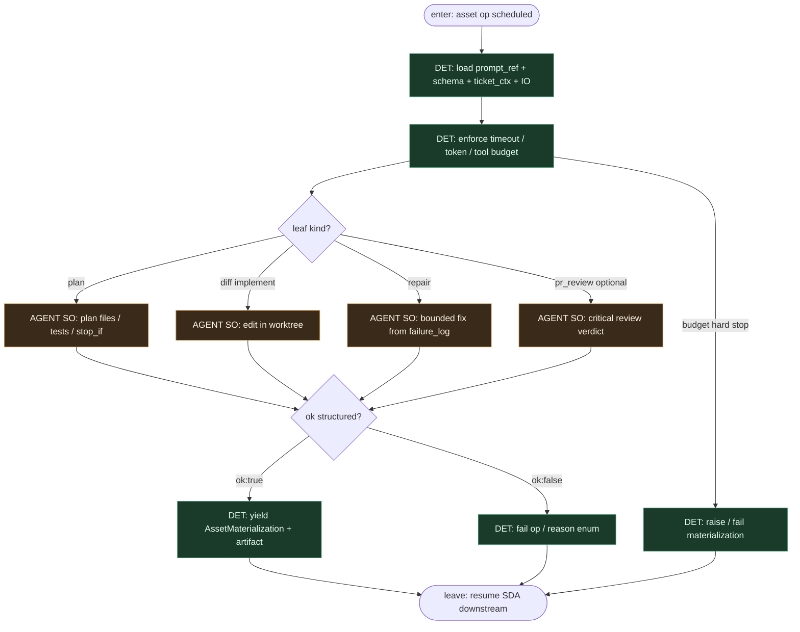

# Subgraph: llm-op-leaf

**Theme:** LLM siedzi **wewnątrz** jednego op / `compute_fn` assetu — wypełnia SO; nie routuje joba ani sensora.  
**Mode mix:** AGENT leaf only. Job/SDA decyduje *kiedy*; op decyduje *jak* w budżecie.

## Flow

## Notes

- **Not a router.** Model nie woła `materialize`, nie zmienia job selection, nie przestawia label FSM, nie merge’uje.
- **One asset, one leaf.** Plan / implement / repair / review = osobne AssetKeys (osobne materializacje). Reviewer ≠ implementer.
- **Structured output.** `ok:true` + artefakt albo `ok:false` + reason enum — brak limbo chat.
- **Op retry ≠ blind re-prompt.** Infra retry przy crashu; semantyka „napraw testy” = nowy asset `repair` zaplanowany przez deps/check po fail `tests`.
- **Meat ≡ AI.** Ten sam schema seat pod assetem.
- **Handoff.** Leave = materialization metadata `{ok, artifact_ref, reason?, usage}` → downstream DET.
