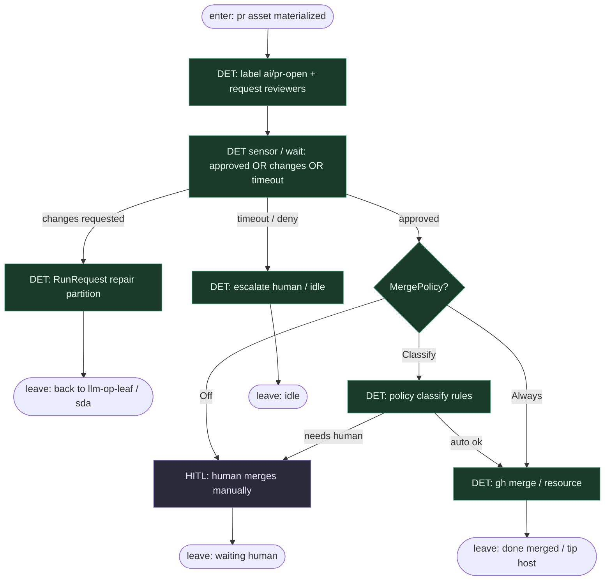

# Subgraph: materialize-merge

**Theme:** Po zmaterializowanym `pr` — HITL / MergePolicy; sensor na approve; merge DET.  
**Mode mix:** DET + HITL. LLM nie jest jedyną bramką merge.

## Flow

## Notes

- **Coder ceiling już za nami.** Ten subgraph nie re-implementuje — tylko review signal + policy.
- **MergePolicy Off|Classify|Always** (KLEPACZ). Always ≠ L5 bank lights-out — nadal CI/checks i jawna polityka.
- **Sensor, nie chat.** Approve = label / review event → kolejny `RunRequest` na merge job / asset — nie „powiedz botowi w PR”.
- **Opcjonalny review SO** może być osobnym assetem *przed* tym subgraphiem; werdykt modelu nie zastępuje HITL gdy polityka = Off.
- **Sukces.** Zmergowany `ai/PR` na tipie hosta w sensownym oknie — nie sam ładny JSON materializacji.
