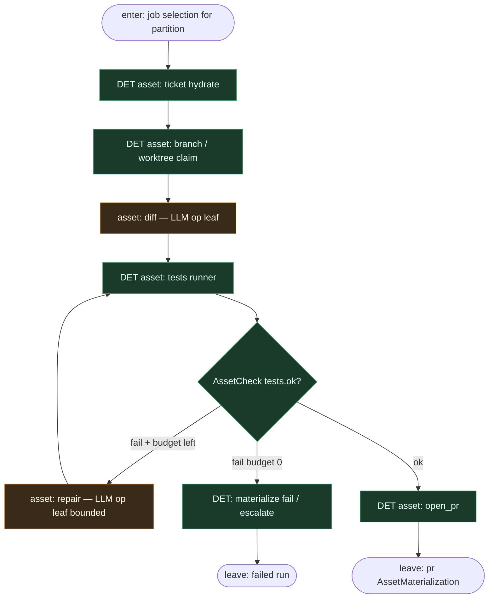

# Subgraph: sda-ticket-to-pr

**Theme:** Software-Defined Assets — stałe deps `ticket → branch → diff → tests → pr`.  
**Mode mix:** DET spine; tylko `diff` (i opcjonalnie plan/repair) ma AGENT op leaf.

## Flow

## Notes

- **Deps są programem.** Kolejność nie jest promptem — graf AssetKey jest fixed w Definitions.
- **Materializacja = checkpoint.** Restart joba pomija już zmaterializowane upstream (Dagster IO manager / versioning wg setupu).
- **`tests` ≠ LLM.** Skrypt / pytest / CI wrapper; wynik strukturalny dla AssetCheck.
- **Coder ceiling = `pr`.** Open PR kończy rolę implementera; review/merge to osobny subgraph.
- **Bounded repair.** Osobny asset / multi-asset z limitem N; nie nieskończona pętla w jednym op.
- **Handoff.** Leave = `{partition, AssetKey:pr, metadata.pr_url}` → materialize-merge.
