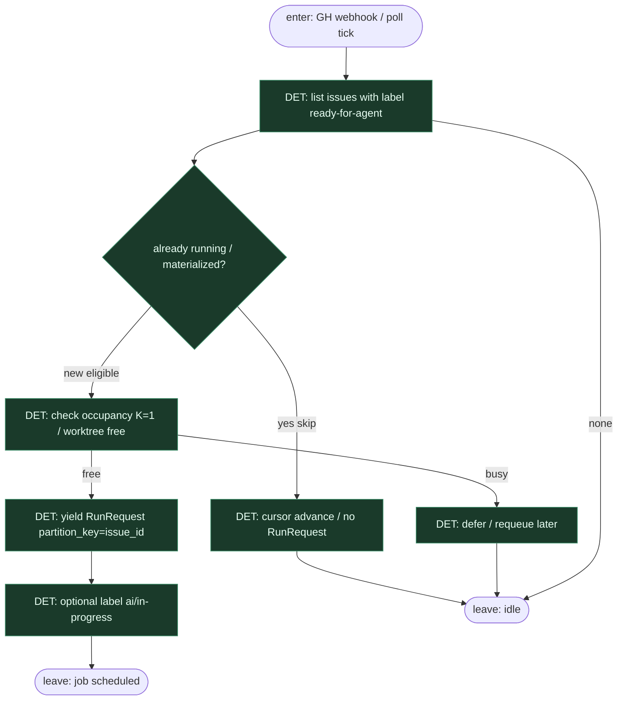

# Subgraph: sensor-github-labels

**Theme:** GitHub label → Dagster **Sensor** → `RunRequest` (partition = issue). Start DET; zero chat-pick.  
**Mode mix:** DET only. Sensor nie woła LLM.

## Flow

## Notes

- **Label = kontrakt startu.** `ready-for-agent` (kanon KLEPACZ) — nie „agent znalazł coś na czacie”.
- **Partition = issue_id.** Jedna partycja → jeden łańcuch SDA → jeden PR (K=1).
- **Sensor idempotentny.** Cursor / tags unikają podwójnego `RunRequest` na ten sam label event.
- **No LLM in sensor.** Ocena „czy brać” = reguły DET (label, occupancy, skip jeśli `pr` już zmaterializowany).
- **Handoff.** Leave = `RunRequest` + tags `{issue_id, label}` → job materializuje selection ticket→…→pr.
