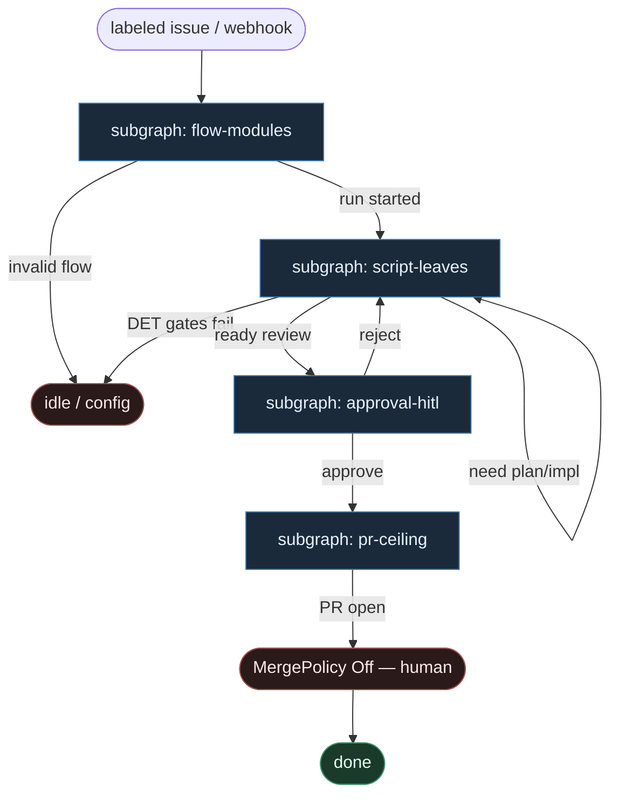

# 49 — Windmill flow compose

**Persona:** `windmill-flow compose` — [Windmill](https://www.windmill.dev/) **scripts + flows** jako DET atoms; topologia ticket→PR żyje w flow YAML/UI; **LLM tylko w typowanych script leaves**; **approval** = HITL; sufit kodera = **open PR**.

**Approach:** `compose`. Nie monolit — składamy małe skrypty (Python/TS/Bash) w flow. Distinct od Prefect (47) i Temporal (46): Windmill = self-hostable script hub + flow DAG + native approval steps.

## Design notes

- **Flow owns next step.** Edges w flow; 0 tokenów orkiestracji.
- **Scripts = atoms.** DET: claim, worktree, test, git, `gh pr create`. AGENT: typed `plan` / `implement` scripts z SO.
- **Approval step = HITL.** Native Windmill approval — nie LLM-judge merge.
- **Meat ≡ AI** w tym samym script leaf.
- **NOT L5.** MergePolicy default **Off**.
- **Cel (SOUL):** zdjąć klepanie ticket→PR; energia na architekturę.

## Top-level flowchart

**DET vs AGENT**

| Layer | Mode | Uwaga |
|-------|------|-------|
| Flow DAG / webhook trigger | DET | agent nie pickuje |
| DET scripts (claim/wt/test/git/gh) | DET | atoms |
| Typed plan/implement scripts | AGENT leaf | SO only |
| Approval step | HITL | nie LLM judge |
| open PR | DET | coder ceiling |
| merge | HITL / policy | default Off |

## Index of subgraphs

| File | Theme |
|------|--------|
| [subgraph-flow-modules.md](./subgraph-flow-modules.md) | flow = program |
| [subgraph-script-leaves.md](./subgraph-script-leaves.md) | DET atoms + LLM leaves |
| [subgraph-approval-hitl.md](./subgraph-approval-hitl.md) | Windmill approval |
| [subgraph-pr-ceiling.md](./subgraph-pr-ceiling.md) | open PR + MergePolicy |

## Mapowanie Windmill → klepacz

| Windmill | Klepacz |
|----------|---------|
| Flow + webhook/label | DET intake |
| Script modules | unix-like atoms |
| LLM script leaf | plan/implement SO |
| Approval | HITL plan/PR |
| `gh` script | PR ceiling |
| LLM as flow router | **FORBIDDEN** |
