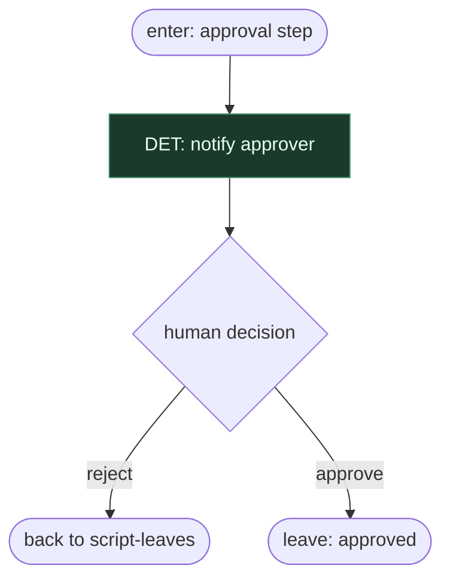

# Subgraph: approval-hitl

**Theme:** Native Windmill approval = HITL gate.  
**Mode mix:** HITL (not LLM judge).

## Flow

## Notes

- Może stać po planie lub przed PR — wg flow.
- Model nie jest jedynym werdyktem.
