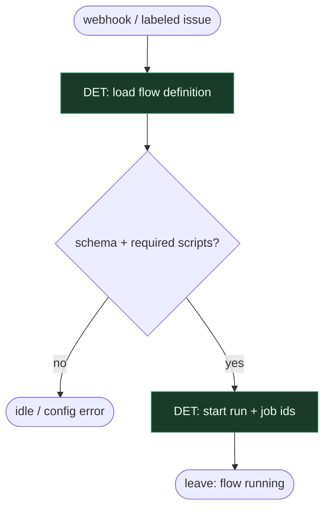

# Subgraph: flow-modules

**Theme:** Windmill flow = program; modules as DET composition.  
**Mode mix:** 100% DET topology.

## Flow

## Notes

- Zmiana procesu = diff flow, nie prompt.
- Handoff: `{run_id, issue, path}` → script-leaves.
