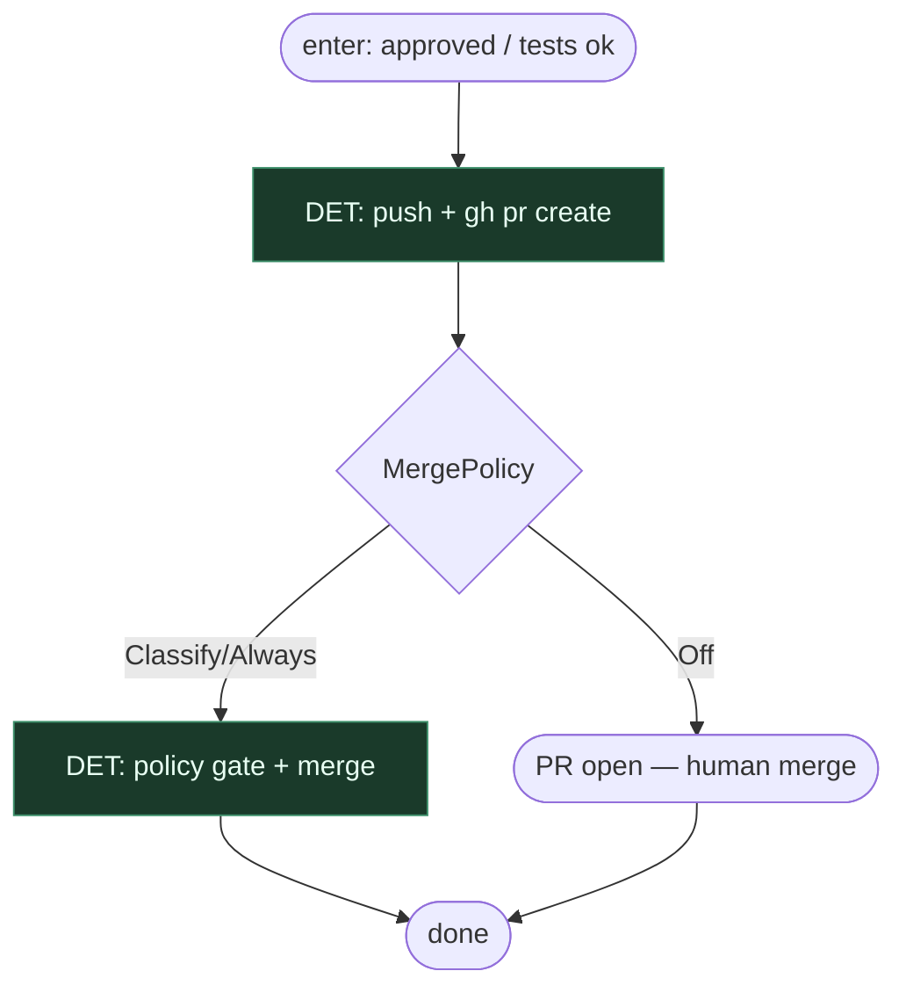

# Subgraph: pr-ceiling

**Theme:** DET open PR + MergePolicy.  
**Mode mix:** DET + HITL merge.

## Flow

```mermaid
flowchart TD
  A([enter: approved / tests ok]) --> P[DET: push + gh pr create]
  P --> M{MergePolicy}
  M -->|Off| H([PR open — human merge])
  M -->|Classify/Always| G[DET: policy gate + merge]
  G --> D([done])
  H --> D

  classDef det fill:#1a3a2a,stroke:#3d8f6a,color:#e8fff3
  class P,G det
```

## Notes

- Default Off.
- Coder ceiling = open PR; nie lights-out.
