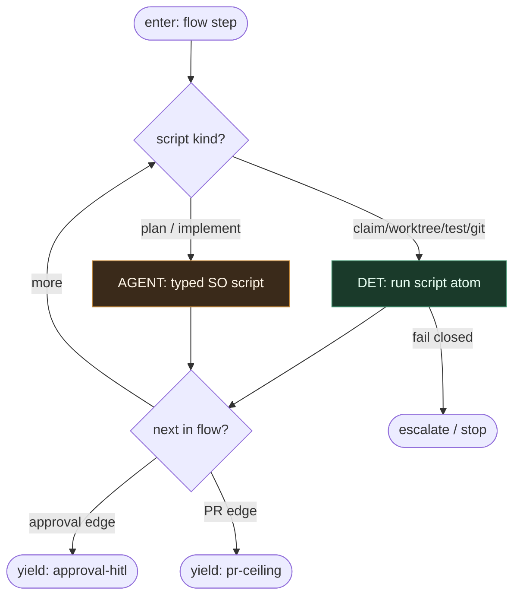

# Subgraph: script-leaves

**Theme:** DET scripts + typed LLM script leaves.  
**Mode mix:** DET majority; AGENT only plan/implement.

## Flow

## Notes

- LLM nie wybiera następnego modułu flow.
- Meat ≡ AI w tym samym leaf.
