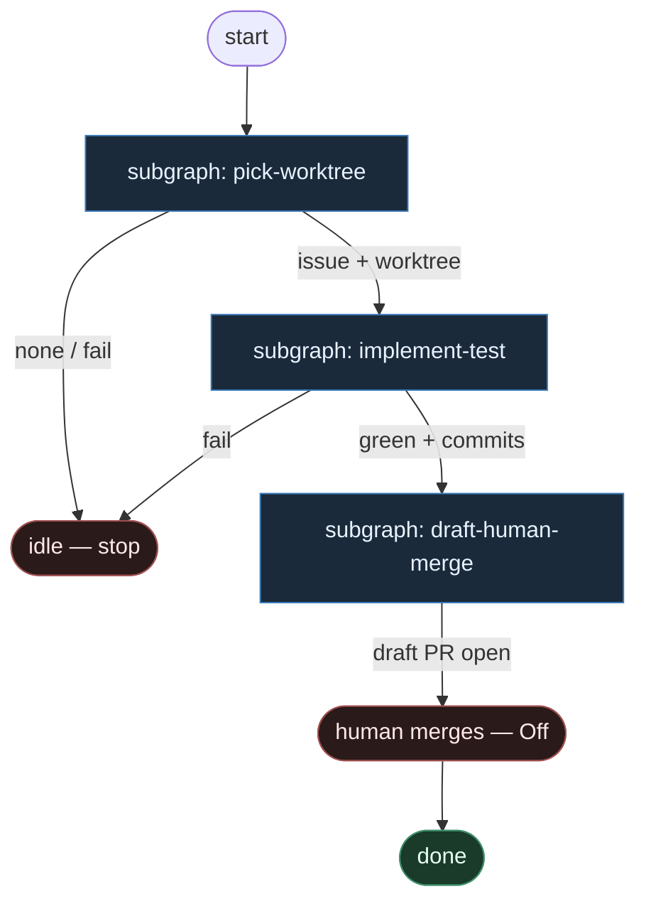

# 50 — Cynical Min

**Persona:** cynical-min compose — absolutny kręgosłup DET: pick → worktree → implement leaf → test → draft PR → human merge. Skasuj wszystko opcjonalne.

**Approach:** `compose` (from_scratch lean). Slug `50-cynical-min`. Polish OK. Obey SOUL.

## Design notes

- **Spine-only.** Sześć kroków. Jeśli węzeł nie jest na liście — nie rysuj go. Max delete/simplify.
- **vs 04-cynical-cuts.** 04 wycina „teatr”, ale zostawia critical review AGENT, CI wait, MergePolicy Off|Classify|Always, gate loop changes→re-implement, bounded repair N=1. Tu **tego też nie ma**. Absolute minimal ticket→draft PR; człowiek merguje.
- **MergePolicy Off only.** Hardcoded. Brak Classify/Always w grafie. Klepacz kończy na **draft PR**; merge = człowiek poza agentami.
- **Agents only implement SO.** Jedyny AGENT seat = implement (structured output). Zero plan leaf, zero review AGENT, zero QA-strategy AGENT.
- **DET reszta.** pick, worktree, test, draft PR — skrypty. Fail = exit. Bez repair loop, bez CI-wait node, bez limbo labels.
- **K=1.** Jeden labeled ticket → jeden worktree → jeden draft PR. Chat nie jest intake.
- **Meat ≡ AI.** To samo siedzenie implement; graf nie rozróżnia.
- **NOT L5.** Nie lights-out. Człowiek trzyma merge + architekturę + niewygodne pytania (poza tickiem — periodycznie, nie jako węzeł grafu).
- **Kryterium:** draft `ai/fix` otwarty; merge świadomie ludzki. Nie ładny JSON `outcome=none`.

## Top-level flowchart

**DET vs AGENT at a glance**

| Layer | Mode | Keep? | Why |
|-------|------|-------|-----|
| Pick labeled K=1 | DET | yes | bez tego nie ma pracy |
| Worktree / branch | DET | yes | PR potrzebuje brancha |
| Plan leaf | — | **CUT** | nie na spine |
| Implement | AGENT SO | **only agent** | jedyna entropia |
| Local test | DET | yes | czerwony = nie otwieraj PR |
| Bounded repair | — | **CUT** | fail = exit |
| Commit (w implement-test) | DET | yes | plumbing |
| Draft PR | DET | yes | ceiling klepacza |
| CI wait node | — | **CUT** | człowiek widzi checks na PR |
| Critical review AGENT | — | **CUT** | człowiek = review + merge |
| MergePolicy Classify/Always | — | **CUT** | Off only |
| Human merge | HITL | yes | poza agentami |

## Index of subgraphs

| File | Theme | Role in chain |
|------|--------|----------------|
| [subgraph-pick-worktree.md](./subgraph-pick-worktree.md) | label → one issue → worktree | DET front door |
| [subgraph-implement-test.md](./subgraph-implement-test.md) | implement SO → test → commit | jedyny AGENT + DET test |
| [subgraph-draft-human-merge.md](./subgraph-draft-human-merge.md) | push → draft PR → human merge | DET ceiling + HITL Off |

## Co świadomie skasowano (vs 04 i vs „pełny” graf)

1. Critical review AGENT (04 miał — tu CUT)
2. CI wait jako węzeł grafu (04 miał — tu CUT)
3. MergePolicy Classify / Always (04 miał gałkę — tu Off only)
4. Gate changes → re-implement loop (04 miał — tu CUT)
5. Bounded repair N=1 w liściu (04 miał — tu fail=exit)
6. plan_issue / normalize / clean-workspace / occupancy FSM / pr_repair / QA-strategy AGENT / dual survey

Zostaje **tylko** to, co przenosi ticket na draft PR. Reszta jest winą wyobraźni.
