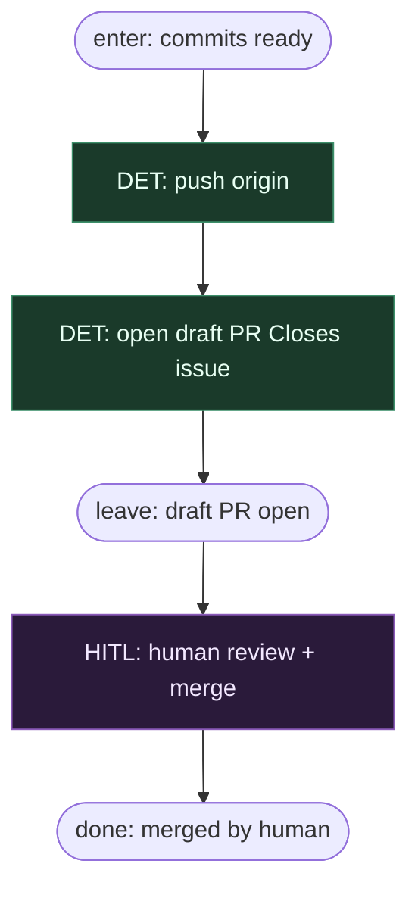

# Subgraph: draft-human-merge

**Theme:** push → otwórz **draft** PR → człowiek merguje. MergePolicy Off only.  
**Mode mix:** 100% DET + HITL human. Zero AGENT review. Zero Classify/Always.

## Flow

## Notes

- **Ceiling klepacza = draft PR.** Nie merge. Nie „Almost Always”.
- **MergePolicy Off hardcoded.** Brak gałki Classify/Always w tym grafie (04 miał — tu CUT).
- **Brak CI-wait node.** Checks żyją na GitHubie; człowiek patrzy przy merge. Nie blokujemy grafu na wait theatre.
- **Brak critical review AGENT.** Review = człowiek (energia na architekturę / niewygodne pytania — SOUL). Agents only implement SO.
- **Brak gate loop.** Rejected draft → nowy tick / nowy przebieg; nie changes→re-implement w tym wariancie.
- **CUT:** apply-labels ceremony, branch cleanup, approve-bot, pr_repair, auto-merge.
- **Handoff:** `{pr_url, branch, head_sha, draft:true}` → human; po merge `{merged:true, sha}` poza agentami.
