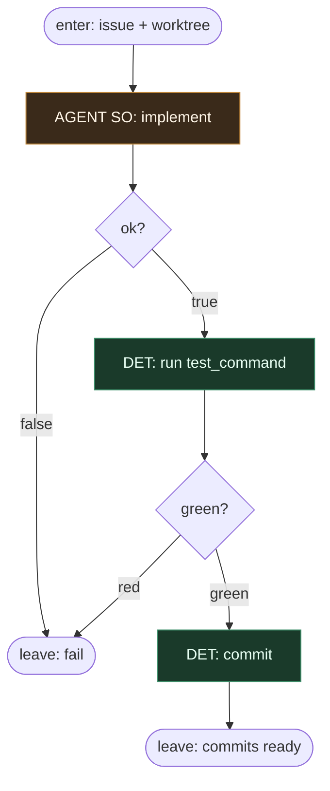

# Subgraph: implement-test

**Theme:** zaimplementuj (SO) → przetestuj → commit. Jedyny AGENT w całym wariancie.  
**Mode mix:** AGENT SO implement; DET test + commit. Plan = CUT. Repair = CUT.

## Flow

## Notes

- **Jedyny AGENT seat w 50.** Structured: `{ok, summary, files_touched}` albo `{ok:false, reason}`. Nic więcej nie woła modelu.
- **Plan leaf CUT.** Ticket mówi CO. Planowanie nie otwiera PR.
- **Zero repair.** Czerwony test = leave fail. Bez N=1 retry (04 miał — tu CUT). Escapism zabija min.
- **Test = DET.** Komenda z ticketa / repo. Agent nie „override’uje” czerwonego.
- **Commit = DET.** Message z ID + summary. Push jest w następnym podgrafie (draft).
- **CUT:** multi-commit product loop, file-breakdown agent, local-check ceremony poza `test_command`, nested SDLC.
- **Handoff:** `{summary, files_touched, head_sha}` albo fail.
