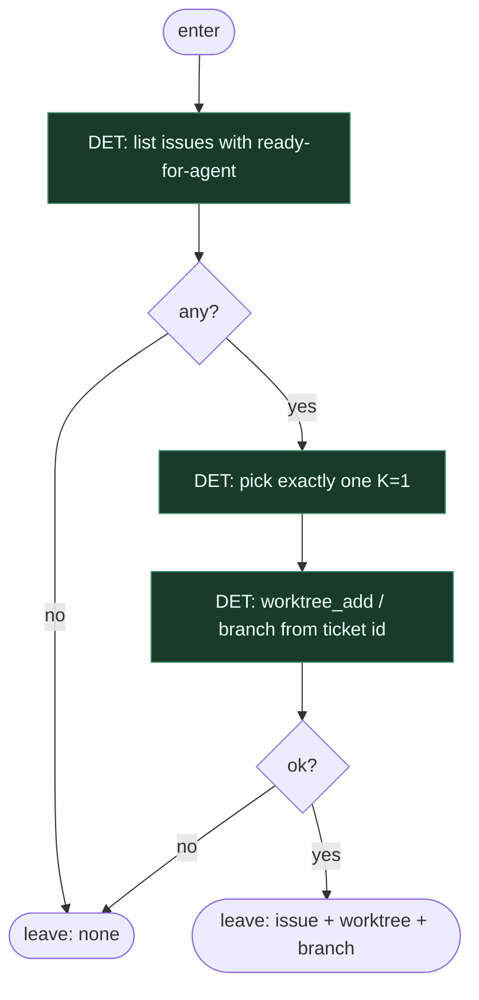

# Subgraph: pick-worktree

**Theme:** etykieta → jeden issue → worktree. Absolutny front door.  
**Mode mix:** 100% DET. Zero agenta. Zero „wybieram z czatu”.

## Flow

## Notes

- **Label = start.** Bez `ready-for-agent` / `ai:ready` nie ma wejścia. Chat nie jest intake.
- **K=1.** Jeden ticket. Nie batch, nie „przy okazji sąsiad”.
- **Worktree = skrypt.** Nazwa brancha z ID. Fail closed — bez occupancy/orphan FSM theatre.
- **CUT vs 04:** osobny acceptance/verify skip jako produktowy węzeł — tu nie rysujemy; niedookreślony ticket i tak padnie na teście albo człowiek odrzuci draft. Max simplify.
- **CUT:** normalize fields, ensure clean workspace, dual survey, ready sieve, limbo labels.
- **Handoff:** `{issue_id, branch, worktree_path, base_ref}` albo `none`.
