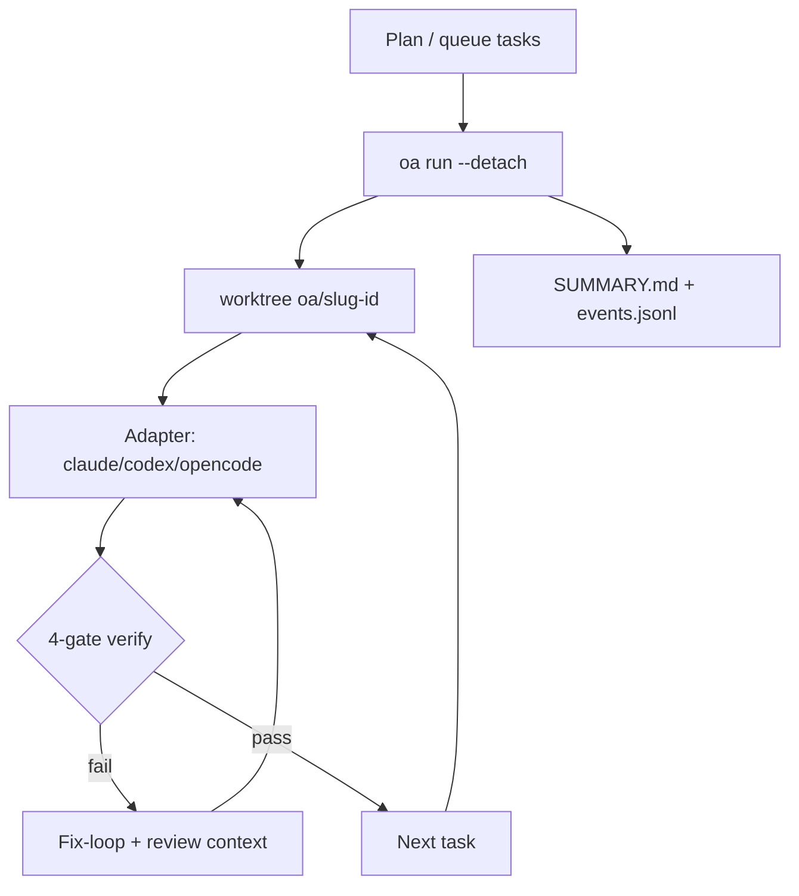

<!-- spine: spine_agent_loop -->
# OvernightAgent (`oa`)

**Repo:** [a20185/OvernightAgent](https://github.com/a20185/OvernightAgent) · ★1 · TypeScript (pnpm monorepo) · MIT · CLI `oa`

## Co to jest

Supervisor overnight: kolejka **planów/tasków**, agent (claude · codex · opencode) w **worktree per task**, potem **4 bramki verify** (tail protocol · commit-since-start · user command · AI review). Fail → fix-loop z wstrzykniętym review. Daemon `oa run --detach` (pidfile + AF_UNIX). Rano: `SUMMARY.md` + `events.jsonl`.

## Graf

## Co / gdzie / jak

| Warstwa | Mechanizm |
|---------|-----------|
| **Trigger** | Intake → queue → `oa run` / `rerun` |
| **Stan** | `runs/<planId>/events.jsonl`, per-task JSON, pidfile |
| **Role** | Supervisor + AgentAdapter + AI reviewer gate |
| **Sandbox** | Worktree; opcjonalnie macOS `sandbox-exec` (`--sandbox`) |
| **Testy** | User verify command + AI review gate |
| **Merge / PR** | Commity w worktree/branch; morning review — nie auto GH PR out-of-box |
| **Resume** | `oa rerun` rewind in-flight worktrees |

Klepacz „plan na biurku → commit w nocy”; PR/merge = poranny człowiek.

## Confidence

**78 / 100** — bogate ADR/testy (519), v0; ★1; brak natywnego forge label→PR.

## Linki

- https://github.com/a20185/OvernightAgent
- HANDOFF.md / ADRs w repo
