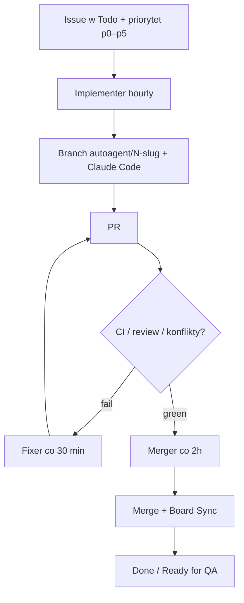

<!-- spine: spine_deterministic -->
# Three-Body Agent (`a7t-ai/three-body-agent`)

Autonomiczny pipeline na GitHub Actions + Claude Code CLI: bierze issue z boardu Projects V2 (`Todo`), implementuje, naprawia własne CI, merguje zielone PR-y i synchronizuje kolumny — bez frameworka (tylko `gh`/`jq`/`curl` + prompty).

## Co / gdzie / jak

| Element | Szczegóły |
|--------|-----------|
| **Trigger** | Cron (Implementer hourly, Fixer 30 min, Merger 2h) + eventy PR; kolejka = kolumna `Todo` + milestone + label priorytetu |
| **Sandbox** | Runner GHA; branch `autoagent/<issue>-<slug>`; sekrety `ANTHROPIC_API_KEY`, `AGENT_PAT` (Projects V2) |
| **Agent** | Claude Code CLI; prompty w `.github/prompts/`; Telegram opcjonalnie |
| **Testy** | Fixer reaguje na fail CI / komentarze review / konflikty; Merger waży review przed merge |
| **Merge** | Auto (Merger) gdy zielono — lights-out; Board Sync: Todo ↔ In Progress ↔ Ready for QA ↔ Done |

## Confidence: **86 / 100**

Textbook klepacz board→PR→merge z dogfoodem (kilka shipping apps w README) i playbookiem. Obniżka: ★13, wymaga PAT + Projects V2 + ręcznego wypełnienia TODO w workflowach; auto-merge bez HITL to świadomy wybór ryzyka.

## Linki

- Repo: https://github.com/a7t-ai/three-body-agent
- Playbook: https://a7t.ai/booklets/three-body-agent-playbook/
- Workflows: `.github/workflows/autoagent-*.yml`
