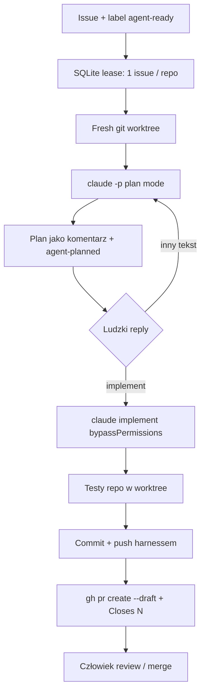

# ableinc/coding-agent-loop

**Confidence: 88** — czysta mrówka Go: label → plan HITL → worktree → testy → draft PR; harness (nie model) własnie git/GitHub; nigdy nie merguje.

## Co to jest

Lokalny daemon w Go, który zbiera open issues z etykietą `agent-ready`, w worktree najpierw każe Claude Code napisać **plan** (komentarz na issue), czeka na ludzkie `implement`, potem implementuje, odpala testy repo, pushuje branch i otwiera **draft PR**. Claude nie pushuje i nie otwiera PR — to robi kod harnessu.

## Graf

## Co / gdzie / jak

| Element | Wartość |
|---------|---------|
| Stack | **Go 1.26+** daemon (+ opcjonalny web UI / control API / systemd) |
| Trigger | Label `agent-ready` (konfigurowalne); discovery org/user-wide z `exclude_repos` |
| HITL | Plan → reply `implement` (inaczej rewizja planu) |
| Sandbox | Izolowany git worktree; agent bez uprawnień do push/PR |
| Agent | Claude Code (`claude -p --output-format stream-json`) |
| Testy | Suite repo przed PR; wynik (pass/fail) w opisie draft PR |
| Merge | **Nigdy** — tylko draft PR; człowiek merguje |
| Stan | GitHub (komentarze + labele) = źródło prawdy; SQLite = cache + lease |
| Nie robi | Auto-merge, work bez labela, architektura produktu |

## Linki

- https://github.com/ableinc/coding-agent-loop
- Config: `config.example.json` / `models.json` w repo
- Deploy: `make install` → systemd `coding-agent-loop.service`
