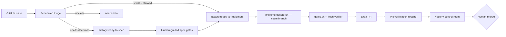

<!-- spine: spine_deterministic -->
# addyosmani/factory

**Repo:** [addyosmani/factory](https://github.com/addyosmani/factory) · ★179 · Shell / Claude Code + Codex skills · MIT

## Co to jest

Reference software factory **bez** własnego orchestratora: GitHub Issues + `factory:*` labels + Claude Code cloud routines (lub Codex) + `CHARTER.md` + `gates.sh` + fresh verifier. Issue → triage → ready-to-implement → draft PR → human merge. Autor: Addy Osmani (wysoka widoczność osoby; sam loop jest wzorcowy klepacz).

## Graf

## Co / gdzie / jak

| Warstwa | Mechanizm |
|---------|-----------|
| **Trigger** | Schedule / GH events / optional API-trigger Action |
| **Stan** | Labels + `factory-handoff:v1` comment — sessionless |
| **Role** | Triage / implement / verify — każda run świeża |
| **Sandbox** | Claude Code / Codex session; charter limituje scope |
| **Testy** | Deterministic gates fail-closed gdy check missing |
| **Merge** | **Nigdy** agent — tylko człowiek |
| **Anti-race** | Deterministic branch `claude/fq-N`; first push wins |

Podręcznikowy KLEPACZ: charter = risk budget, label = weź, draft PR = output.

## Confidence

**80 / 100** — klarowny model operacyjny; nie obscure (brand autora); zależy od Claude routines jako clock.

## Linki

- https://github.com/addyosmani/factory
