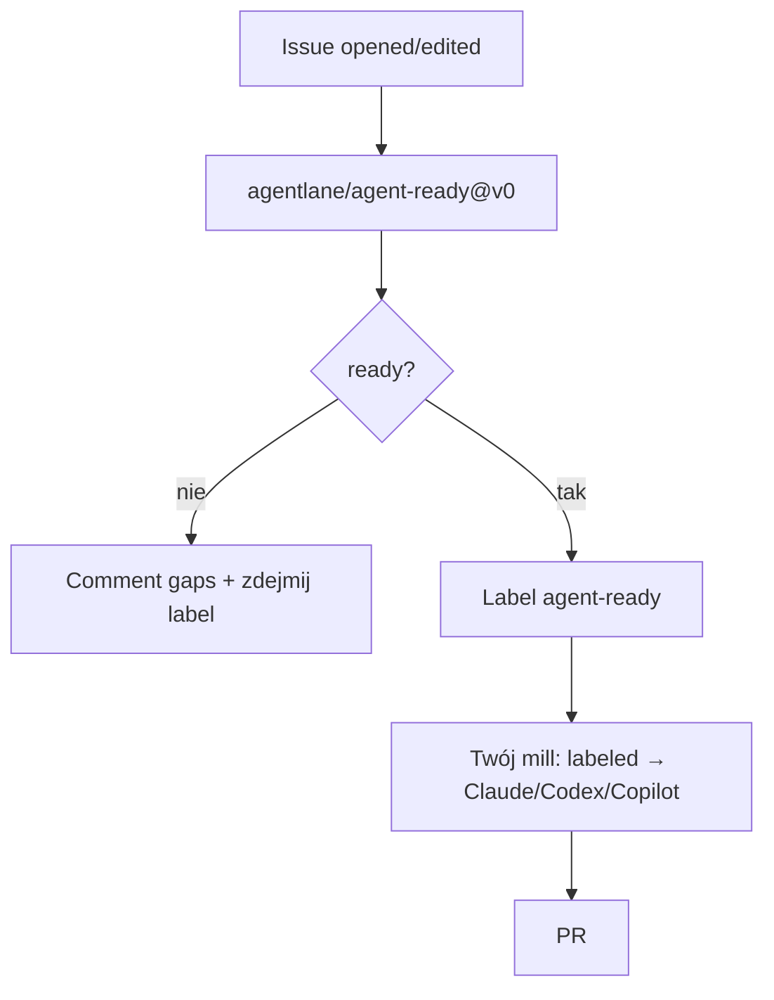

<!-- spine: spine_deterministic -->
# Agent Ready Gate (`agentlane/agent-ready`)

Marketplace Action + CLI/MCP/SDK: **Definition-of-Ready** przed agentem. Lintuje ticket (AC, repo target, risk, ambiguous verbs…), komentuje issue i przełącza label `agent-ready` — dopiero wtedy drugi workflow dispatchuje coding agenta.

## Co / gdzie / jak

| Element | Szczegóły |
|--------|-----------|
| **Trigger** | `issues: [opened, edited, labeled]`; wyjście = label `agent-ready` jako gate dla drugiego workflow |
| **Sandbox** | GHA (Docker action) lub lokalnie `npx @agentlane/agent-ready`; adaptery GitHub / Jira / Linear |
| **Agent** | Brak — czysty linter (~50 ms); MCP `agent_ready_check` dla Claude/Cursor |
| **Testy** | 12 reguł + OPA/Rego + opcjonalny LLM judge; sygnały `path_recommendation` A/B/C |
| **Merge** | N/A (pre-flight); komponuje się z dowolnym klepaczem label→PR |

## Confidence: **78 / 100**

Najlepszy Marketplace „front door” do klepacza w tej fali; jasny kontrakt label. Obniżka: ★0, sam nie implementuje — consumer musi podłączyć dispatch; produkt młody (0.2.x).

## Linki

- Repo: https://github.com/agentlane/agent-ready
- Marketplace: https://github.com/marketplace/actions/agent-ready-gate
- npm: `@agentlane/agent-ready`
