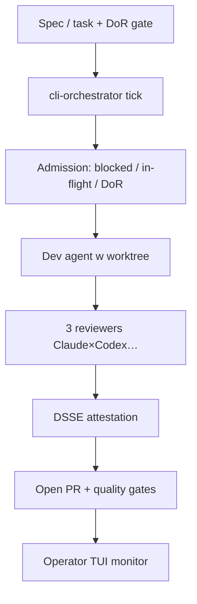

<!-- spine: spine_deterministic -->
# AI-SDLC Framework (`ai-sdlc-framework/ai-sdlc`)

Decision Engine + autonomiczny orchestrator: operator domyka **Definition-of-Ready**, `cli-orchestrator tick` chodzi po grafie zależności, dispatchuje subagentów w worktree, 3 reviewerów cross-harness, DSSE attestation → **PR otwiera się sam**.

## Co / gdzie / jak

| Element | Szczegóły |
|--------|-----------|
| **Trigger** | DoR + `cli-orchestrator` / `/ai-sdlc execute AISDLC-N`; flag `AI_SDLC_AUTONOMOUS_ORCHESTRATOR=experimental` |
| **Sandbox** | Izolowane git worktrees; agent-agnostic runners (Claude Code, Codex, Cursor, Copilot, Aider…) |
| **Agent** | Plugin Claude Code + SDKi; cross-harness independence by construction |
| **Testy** | QualityGate declarative (advisory→hard); conformance suite; attestacje |
| **Merge** | PR auto-open; merge przez declarative gates / człowieka wg AutonomyPolicy |

## Confidence: **80 / 100**

Najcięższy governance mill w fali (★276, RFC/spec, ai-sdlc.io). Obniżka: orchestrator experimental; to platforma decyzji, nie jedno YAML „label→PR”; krzywa wejścia wysoka.

## Linki

- Repo: https://github.com/ai-sdlc-framework/ai-sdlc
- Docs: https://ai-sdlc.io/docs
- Concepts: DoR gate, autonomous orchestrator, cross-harness review
