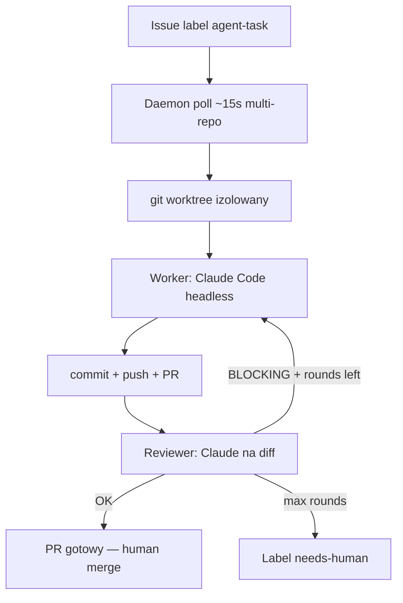

# aignermax/autonomous-issue-agent — EU (Monachium)

**Repo:** [aignermax/autonomous-issue-agent](https://github.com/aignermax/autonomous-issue-agent) · ★1 · Claude Code headless · autor: Max Aigner (Munich / Akhetonics)

## Co to jest

Lokalny daemon EU: polluje wiele repo pod label **`agent-task`** → clone/worktree → Claude Code headless (implement + build/test + self-fix) → push → PR (+ opcjonalnie close issue). Worker→Reviewer loop w worktree; blocking findings wracają do Workera; eskalacja `needs-human`. Nie SaaS US, nie marketing-only.

## Graf

## Co / gdzie / jak

| Warstwa | Mechanizm |
|---------|-----------|
| **Trigger** | Label `agent-task` (+ opcjonalnie `critical` → mocniejszy reviewer) |
| **Stan** | Session management lokalne; label FSM na Issues |
| **Role** | Worker + Reviewer (osobne konteksty Claude) |
| **Sandbox** | Worktree pod `~/.aia-worktrees/…`; headless CLI (API key, nie OAuth) |
| **Testy** | Build/test w pętli Workera |
| **Merge** | Człowiek; agent nie auto-merguje (PR ready) |

## Confidence

**80 / 100** — żywy kod + jasny FSM; ★1 obscure EU; wymaga Claude API (koszt); brak dużego public dogfood.

## Linki

- https://github.com/aignermax/autonomous-issue-agent
